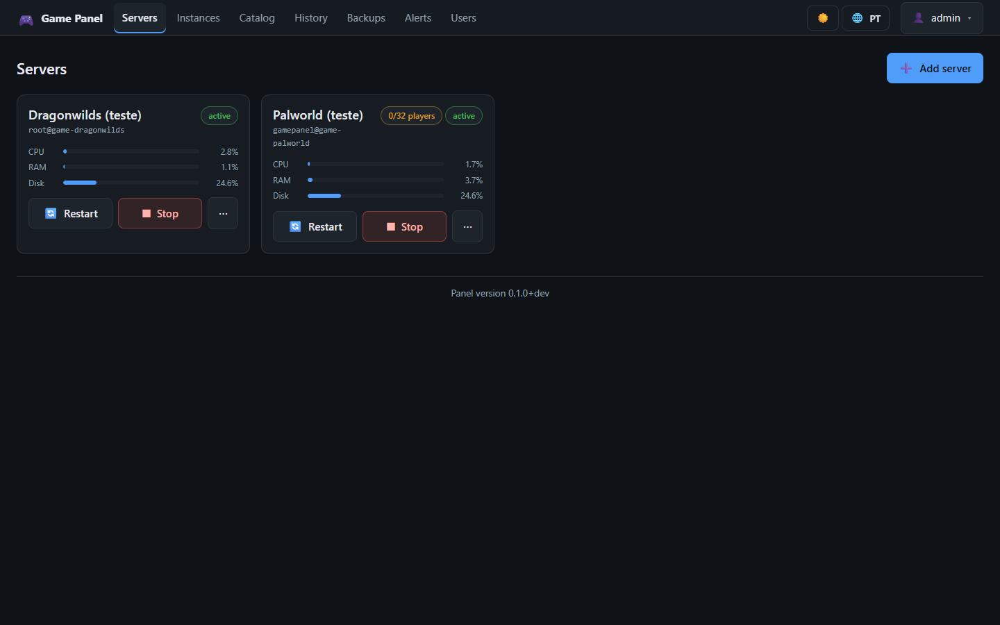
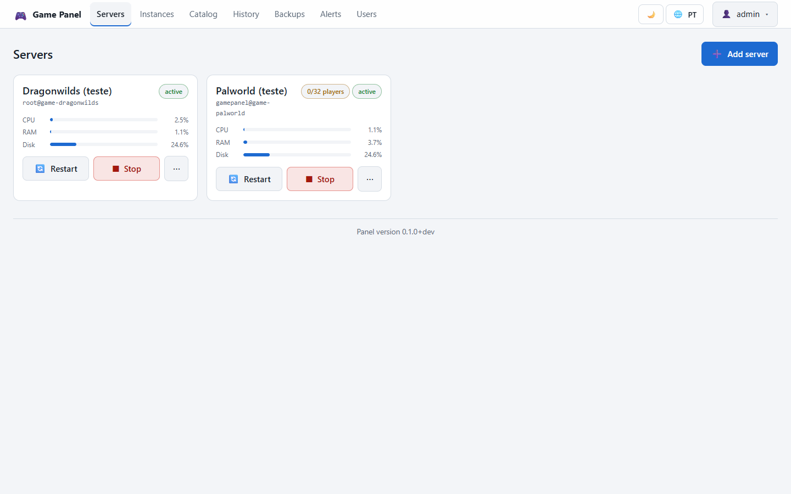
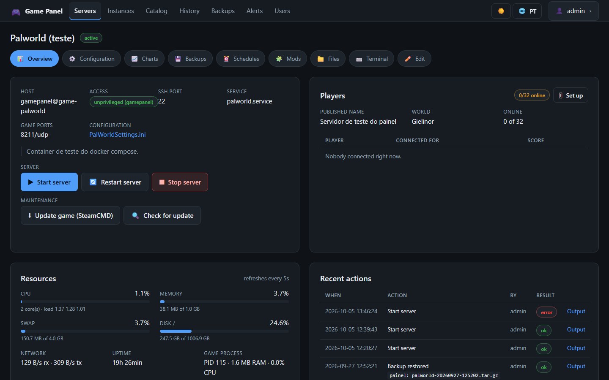
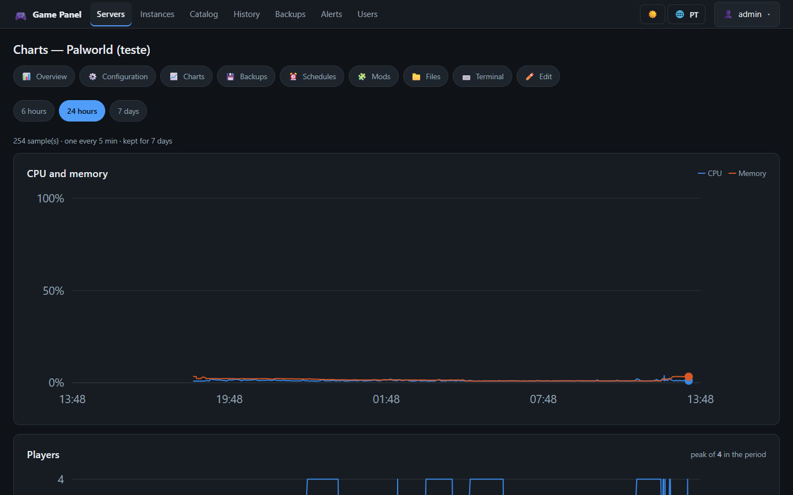
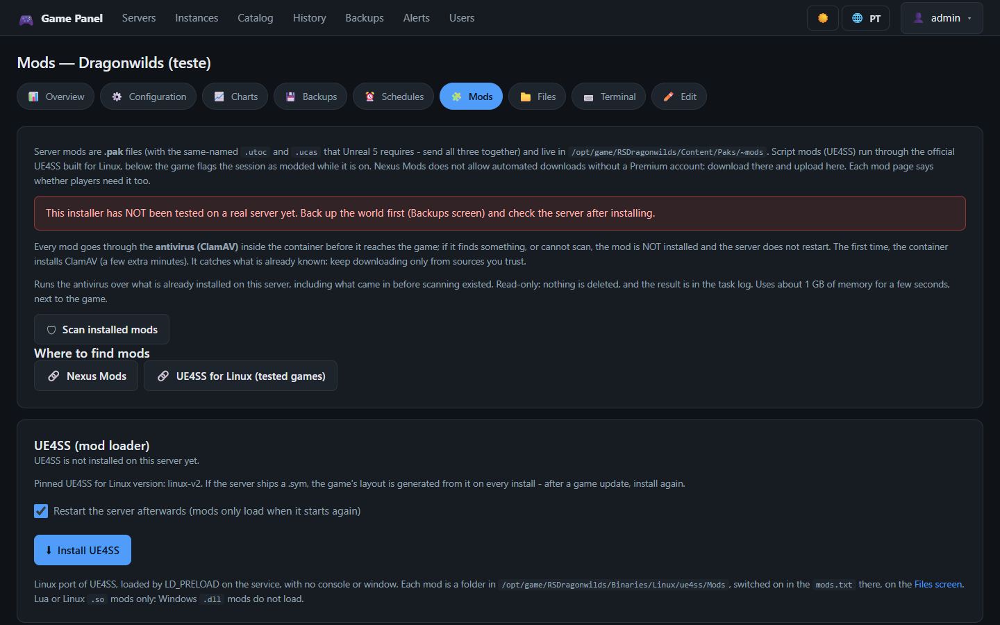
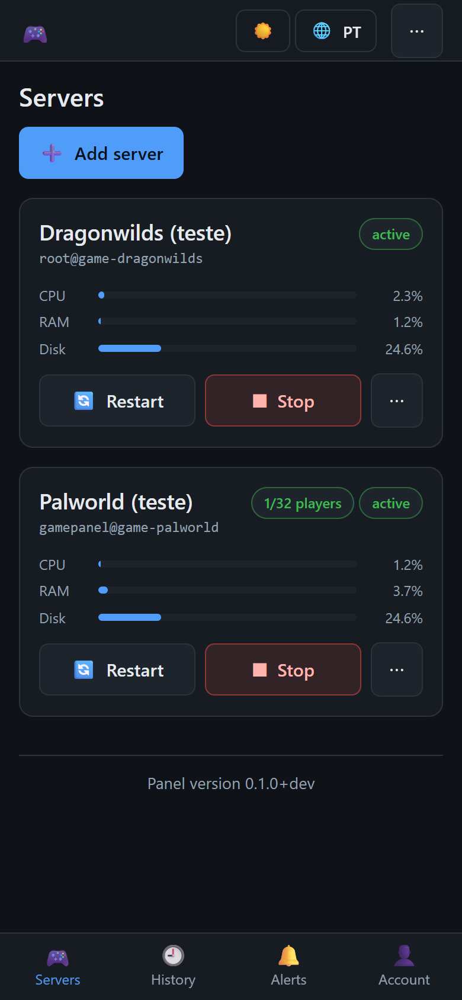
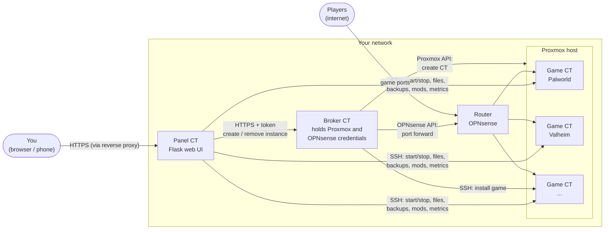
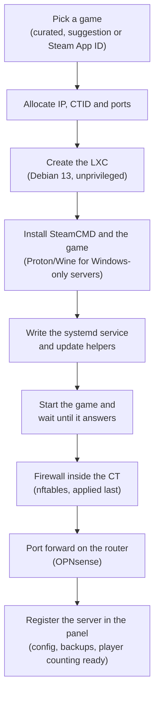

# Game Server Deploy and Panel

**The goal: deploying a dedicated game server on Proxmox or Docker should be one command,
with nothing left to do by hand.** The project automates the whole path - container,
SteamCMD, the game itself (Linux build or Windows build under Proton), the systemd service,
the firewall inside the container, the port forward on the router, registration in the
panel - and then gives you a mobile-first **web panel** to run all of it day to day: start
and stop, updates, players, config, files, mods, backups, schedules and alerts.

It is inspired by [LinuxGSM](https://github.com/GameServerManagers/LinuxGSM) but built
around containers: each game lives in its own Proxmox LXC (or Docker container), and an
optional **broker** lets the panel create and remove those containers on Proxmox and open
the ports on the router (**OPNsense** today) without the panel ever holding the
credentials. Generic port forwarding for common home routers is on the
[roadmap](#roadmap).

[](https://github.com/ocristopfer/game-server-deploy/actions/workflows/ci.yml)
[](LICENSE)

## Screenshots

| | |
|---|---|
|  |  |
| Dashboard (dark theme) | Dashboard (light theme) |
|  |  |
| Server page: status, players, resources, actions | Charts: CPU, memory and players over 6h / 24h / 7 days |
|  |  |
| Mod manager (per game) | Phone layout, installable as a PWA |

## Features

- **One-command deploy** of a game to its own Proxmox LXC container or Docker container, from
  a single game definition (`games/<game>.env`); Windows-only servers run under **Proton**
  (or Wine) inside the container.
- **Web panel** (Flask, stdlib only plus `python3-flask` from apt; no pip, no CDN, no build
  step in production):
  - start / stop / restart / update (SteamCMD), live logs, per-server **resource meters**
    (CPU, memory, swap, disk, network, game process) read over SSH, no agent;
  - **charts** of CPU, memory and players over 6h / 24h / 7 days;
  - **players online** through Steam A2S query, the game's HTTP API, the server log or
    active connections on the game port, with **kick / ban / broadcast** where the game API
    supports it (Palworld);
  - **quick config editor** that opens the game's `.ini` / `.json` / `.cfg` as a form, plus a
    full **file manager** (browse, edit, upload, download, delete);
  - **interactive terminal** (real TTY over SSH) and one-shot commands;
  - **backups** stored in the game container and copied to the panel, with restore;
  - **schedules** (daily, weekly, every N hours) for restart, stop, start, update and backup;
  - **alerts** to Discord, Slack or any JSON webhook (server down, crashed, restart loop,
    not responding, lost contact, disk almost full, errors in the log...);
  - **mod manager per game** (BepInEx/Thunderstore, UE4SS, UE4SS for Linux, Shroudtopia,
    Oxide, SML, Steam Workshop through the game config, ETS2 server packages), with every
    downloaded or uploaded mod scanned by ClamAV first;
  - **history** of every action, with filters;
  - **users and roles** (administrator and operator);
  - **2FA (TOTP)** with QR code and recovery codes, and **passkeys** (device biometrics,
    WebAuthn);
  - **light / dark theme toggle** and **Portuguese / English language toggle** in the top
    right corner;
  - **PWA**: installable on the phone home screen, phone-first layout.
- **Broker** (optional): a separate service that holds the Proxmox and OPNsense credentials
  and exposes fixed verbs (create / disable / remove instance, catalog). The panel's
  **Catalog** and **Instances** screens use it to create game servers with one click.
- **Per-container firewall** (nftables) on the panel, broker and every game container.
- **Deterministic releases**: the same commit always produces the same tarball and sha256,
  installed by folder with a symlink and automatic rollback.

## How it works



What happens when a game is created (from the panel through the broker, or with
`deploy-game.ps1` from your machine - both run the same install phases):



The panel never talks to Proxmox or to the router directly: if the panel is compromised,
the broker only exposes a few fixed verbs (create, disable, remove an instance; catalog),
and every broker action requires the admin's second factor.

## Quick start (local, development only)

To try the panel without Proxmox, you only need Docker:

```bash
docker compose up --build -d          # panel at http://localhost:8080 (admin / admin12345)
```

This starts the panel plus two **fake** game containers (Debian with `sshd`, a simulated
`systemctl`/`journalctl`, an A2S query responder, a REST API and a log) that are already
registered in the panel, plus a toy broker with fake backends. Everything works end to end:
start/stop/update, terminal, file editor, Config screen, player counting.

> **This is a development environment.** The login `admin` / `admin12345` is fixed, the code
> is bind-mounted and reloaded on change, and the containers are not hardened. It is bound to
> `localhost`; never expose it to a network. See [Local development](#local-development) for
> details.

## Installation

### Downloading a release

Releases are published on [GitHub Releases](../../releases) whenever a `vX.Y.Z` tag is pushed
(`.github/workflows/release.yml`). Each release has:

| Asset | What it is |
|-------|------------|
| `gamepanel-<version>.tar.gz` + `.sha256` | the panel Python package |
| `gamebroker-<version>.tar.gz` + `.sha256` | the broker Python package |
| Source code (zip / tar.gz) | the whole repository at that tag: deploy scripts, `lib/`, `games/`, `tools/` |

The tarballs are built by `tools/build-release.py`, which is **deterministic**: sorted
names, owner/group zeroed, the commit's mtime, and `mtime=0` in the gzip header. Two builds of
the same commit give the **same sha256**, so the hash answers "is this container running this
exact code?", not just "did the file arrive intact?". You can rebuild it yourself and compare:

```bash
python tools/build-release.py gamepanel    # dist/gamepanel-0.1.0+abc1234.tar.gz + .sha256
python tools/build-release.py gamebroker
```

There are two ways to install:

1. **Run the deploy scripts from the release source archive** (the normal path). Extract the
   source archive on a Windows machine, copy `.env.example` to `.env`, fill it in and run the
   scripts under `deploy/` (described below). The scripts package the panel/broker themselves
   and ship the tarball plus `lib/install-release.sh` to the container.
2. **Install a release tarball by hand** inside a container that already has the service set
   up, with the same installer the deploy scripts use:

   ```bash
   sha256sum -c gamepanel-<version>.tar.gz.sha256
   bash lib/install-release.sh <package> <tarball> <sha256> <app_dir> <service> [health_command]
   # e.g.
   bash lib/install-release.sh gamepanel gamepanel-0.1.0+abc1234.tar.gz <sha256> /opt/gamepanel gamepanel.service
   ```

   The installer checks the sha256, extracts the release into a **new folder**, flips the
   `current` symlink atomically, restarts the service, waits for the health probe and **rolls
   back by itself** if the service does not come up. It keeps the last 5 releases.

Without git (e.g. a source archive), a self-built package has no commit and an empty build
date; its version shows as `X.Y.Z+dev`. A dirty tree is marked `.dirty` in the file name and
on screen.

### Prerequisites

- A Windows machine to run the `.ps1` deploy scripts (Windows PowerShell 5.1 is enough), with
  `ssh` and `scp` (built into Windows 10/11).
- For the Proxmox path: SSH as `root` to the Proxmox host (preferably by key; with a password
  see [Proxmox access by password](#proxmox-access-by-password)).
- For the Docker path: Docker on the target machine (local or remote).

### Deploy paths at a glance

| What | Command | Where it lands |
|------|---------|----------------|
| Panel | `.\deploy\admin\deploy-admin.ps1` (`-Full` to create/reconfigure the CT) | a Proxmox LXC |
| Broker | `.\deploy\broker\deploy-broker.ps1` | its own Proxmox LXC |
| Game on Proxmox | `.\deploy\game\deploy-game.ps1 -Game palworld` | its own LXC, with real systemd |
| Game on Docker | `.\deploy\game\deploy-docker.ps1 -Game palworld` | any machine with Docker |
| Panel on Docker | `.\deploy\game\deploy-docker.ps1 -Panel` | `http://localhost:8080` |
| Firewall for existing CTs | `.\deploy\firewall\apply-firewall.ps1` | panel, broker and game CTs |

Recommended order on Proxmox: panel first (games read its SSH key), then the games or the
broker.

## Deploying games

The same game definition (`games/<game>.env`) is used by both targets:

| Target | Command | When to use |
|--------|---------|-------------|
| **Proxmox LXC** | `.\deploy\game\deploy-game.ps1 -Game palworld` | you have Proxmox and want each game in its own container with real systemd |
| **Docker** | `.\deploy\game\deploy-docker.ps1 -Game palworld` | any machine with Docker (even your PC), no Proxmox involved |

On the Proxmox path the `.ps1` runs on Windows, sends the bundle over SSH to the host and
runs `provision-game-lxc.sh` there (which uses `pct`). On the Docker path the same kind of
`.ps1` generates the stack, builds the image and starts the container. Either way the server
ends the deploy **already registered in the panel**.

### Automatic mode (everything from .env)

```powershell
Copy-Item .env.example .env   # edit CTID, storage, network, memory, cores, disk...
.\deploy\game\deploy-game.ps1 -Game dragonwilds
```

### Interactive mode (asks for each value)

```powershell
.\deploy\game\deploy-game.ps1 -Game dragonwilds -Interactive
```

Values from `.env` (if it exists) become the prompt defaults; Enter accepts.

### Generic deploy by Steam App ID

```powershell
.\deploy\game\deploy-game.ps1 -AppId 4019830
```

Use the App ID of the **dedicated server** (look it up on [SteamDB](https://steamdb.info)).
The script tries to detect the start script (`*.sh` at the root of the install). If the game
needs arguments or has known ports, create a `games/<name>.env` from `games/_template.env`.

### What the script does

1. Downloads the Debian template (if needed) and creates the LXC (`pct create`) with the
   resources from `.env`, or the game's recommended ones if left blank.
2. Installs dependencies (`lib32gcc-s1` etc.), creates the `steam` user and installs SteamCMD
   in `/opt/steamcmd` (skipped if present).
3. Installs/validates the game in `/opt/game` with `app_update <id> validate` (anonymous login).
4. Creates the systemd service `<game>.service` (start on boot, restart on failure) and the
   shortcuts `update-game`, `game-restart` etc. inside the CT.
5. Starts the server, checks it is active and prints the summary with **the ports to forward**.
6. **Registers the server in the panel** (`--register-server`) with the CT IP, systemd unit,
   ports, player counting method and config files, so the **Config** screen opens ready.
   `-NoRegister` skips this step.

Step 2 also installs `sshd` in the CT and authorizes the key of the
[web panel](#web-panel); without it the server would show up registered but would not
respond. The key is read from the panel itself (`ADMIN_CTID`, or `ADMIN_HOST`/`ADMIN_IP_CIDR`
when it does not live on this Proxmox); `PANEL_PUBKEY` in `.env` still works and takes
precedence.

Running it again is idempotent: it updates the CT config and revalidates the game.
`RECREATE_CT=1` destroys and recreates the container.

### One container per game

Each game lives in its own CT with its own IP. In `.env`, any key from the "LXC container"
section can be specialized per game with the suffix `_<GAME_KEY in uppercase>`:

```ini
CTID_DRAGONWILDS=210
IP_CIDR_DRAGONWILDS=10.20.1.20/24

CTID_PALWORLD=211
IP_CIDR_PALWORLD=10.20.1.21/24
MEMORY_PALWORLD=16384        # works for any key: CORES_, ROOTFS_SIZE_GB_, SWAP_...
```

The unsuffixed `CTID`/`IP_CIDR` remain as a **fallback**: they apply to the generic deploy
(`-AppId`) and to games without their own block. The CT hostname is already the game name, so
`HOSTNAME_OVERRIDE` is not needed.

Because the deploy is idempotent **per CTID**, pointing two games at the same id would not
create a new container; it would reconfigure the existing one and swap the game running in
it. So `deploy-game.ps1` stops before sending anything if the resolved CTID or IP already
belongs to another game or to the panel:

```
THROW: CTID 210 ja pertence ao jogo DRAGONWILDS (CTID_DRAGONWILDS no .env).
       Defina CTID_SATISFACTORY com um id livre.
```

At the start of each deploy the script prints the resolved target; check it before letting it
run:

```
Valores especificos de SATISFACTORY: CTID, IP_CIDR
Alvo: CT 212 (satisfactory) em 10.20.1.22/24
```

(The scripts' console messages are in Portuguese.)

Reference layout for games deployed this way (the one in `.env.example`):

| CTID | Game | IP |
|------|------|-----|
| 209 | gamepanel (panel) | 10.20.1.19 |
| 210 | dragonwilds | 10.20.1.20 |
| 211 | palworld | 10.20.1.21 |
| 212 | satisfactory | 10.20.1.22 |
| 213 | enshrouded | 10.20.1.23 |
| 214 | dayz | 10.20.1.24 |
| 215 | icarus | 10.20.1.25 |
| 219 | fallback / `-AppId` | 10.20.1.29 |

Containers created by the broker use a different range; see [Addresses](#addresses-the-ip-tells-the-ctid).

### Shortcuts inside the container

The deploy installs shortcuts in the container. They work **both ways**: logged in as root
inside the CT (`pct enter <CTID>` or SSH) or from the Proxmox host with `pct exec`.

| Shortcut | What it does |
|----------|--------------|
| `game-restart` | restarts the server |
| `game-stop` | stops the server |
| `game-start` | starts the server |
| `game-status` | service status |
| `game-logs` | live log (accepts journalctl args, e.g. `game-logs -n 50`) |
| `update-game` | updates the game via SteamCMD (stop / update / restart) |
| `check-game-update` | checks for an update without touching anything unnecessarily |

```bash
# inside the container
game-restart
game-logs

# from the Proxmox host
pct exec <CTID> -- game-restart
pct exec <CTID> -- game-status
pct exec <CTID> -- update-game
```

> The shortcuts live in `/usr/local/bin` with a symlink in `/usr/bin`. The symlink exists
> because `pct exec` does not use a login shell and its PATH does not include
> `/usr/local/bin`; without it, `pct exec <CTID> -- update-game` fails with `Failed to exec`.
>
> In containers created before this version the symlinks do not exist; recreate them with
> `pct exec <CTID> -- bash -lc 'for f in update-game check-game-update; do ln -sfn /usr/local/bin/$f /usr/bin/$f; done'`
> or run the deploy again.

### Automatic updates

The deploy installs a systemd timer (`game-update-check.timer`) that runs every day at 06:00
(configurable with `UPDATE_SCHEDULE` in `.env`, OnCalendar format). It compares the installed
buildid with the latest one on Steam and **only stops/updates/restarts the server when there
really is an update**; otherwise nothing is touched. Disable it with `AUTO_UPDATE=0`.

```bash
pct exec <CTID> -- systemctl list-timers game-update-check.timer   # next run
pct exec <CTID> -- check-game-update                                # check now
pct exec <CTID> -- journalctl -u game-update-check.service -n 20   # check log
```

### Games that require a Steam account

Almost every dedicated server downloads with `+login anonymous`. DayZ does not: the depot is
behind an account that owns the game. Such games set `STEAM_ANONYMOUS=0` in
`games/<game>.env`, and the deploy reads the credentials from `.env`, **never from
`games/*.env`, which is in git**:

```ini
STEAM_USER=dedicated-account
STEAM_PASS=account-password
```

If the account uses Steam Guard, the code is valid for a few seconds; pass it at deploy time
instead of leaving it in `.env`:

```powershell
.\deploy\game\deploy-game.ps1 -Game dayz -SteamGuardCode 12345
```

With no credentials at all, the deploy stops before sending anything:

```
THROW: O servidor de dayz nao esta disponivel por login anonimo na Steam.
       Preencha STEAM_USER e STEAM_PASS no .env (conta que POSSUA o jogo) ou use -Interactive.
```

How the password is handled:

- It is only used on the **first** install. After that SteamCMD keeps the token in
  `~steam/Steam/config/config.vdf` inside the CT, and `update-game`/`check-game-update` use
  only `+login <user>`; the password is **not** stored in the container scripts.
- The `deploy.env` sent to Proxmox goes to `/root/game-deploy` with `chmod 600`, and the local
  copy in `%TEMP%` is deleted at the end of the deploy.
- If the token expires, the automatic update fails (it does not hang: it runs with `timeout`
  and no stdin). Run the deploy again with `-SteamGuardCode` to renew it.
- Use an account **dedicated** to the server, not your main one.

> Recommended: `-Interactive` asks for the password without echoing it, instead of keeping it
> in `.env`.

**Through the panel (broker).** DayZ can also be created from the **Instances** screen when
the broker has an account: `STEAM_USER`/`STEAM_PASS` in `broker.secrets.env` and
`.\deploy\broker\deploy-broker.ps1`. There is no way to type a code there (the login happens
minutes after the click, inside the new CT), so the account must have **no Steam Guard**;
use an account DEDICATED to servers that owns the game, never your personal one. Without the
account DayZ stays "manual" in the catalog, with the reason shown.

### Deploying on Docker (no Proxmox)

Same games, same `games/<game>.env` definitions, same panel, but in Docker containers. Use it
to run everything on your own PC, a NUC, any server with Docker, or a remote Docker host.

```powershell
.\deploy\game\deploy-docker.ps1 -Panel                  # starts the panel (http://localhost:8080)
.\deploy\game\deploy-docker.ps1 -Game palworld          # starts the game and registers it in the panel
.\deploy\game\deploy-docker.ps1 -Game dayz -SteamGuardCode 12345
.\deploy\game\deploy-docker.ps1 -Game palworld -Down    # stops the server (the world stays in the volume)
.\deploy\game\deploy-docker.ps1 -Game palworld -Recreate
```

Start the panel **before** the first game: the game container authorizes the panel's SSH key.
After that every game deploy is born manageable and **registered**, with its config file
pointed out, so the **Config** screen opens ready.

What the deploy does:

1. Creates the `games` network (the panel talks to the games over it, by container name).
2. Generates the stack in `docker/stacks/<game>.yml`, which you can read before starting it
   (it is regenerated on every deploy, so adjust `.env`, not the `.yml`).
3. Builds the `gamesrv-<game>` image (Debian + SteamCMD + `sshd` + the panel shortcuts).
4. Starts the `game-<game>` container with the game ports published and memory/CPU limits
   from `MEMORY`/`CORES` in `.env` (or the game's recommendation).
5. Registers the server in the panel (`--register-server`) with ports, player counting method
   and config files.

The container does what `provision-game-lxc.sh` does in LXC: installs the game through
SteamCMD, runs the game's `PRE_INSTALL_CMD`/`POST_INSTALL_CMD`, detects the start script and
starts the server. Since there is no systemd inside a container, its role is played by custom
`systemctl`/`journalctl` scripts (in `docker/gameserver/`) with **the same interface** the
panel uses, so start/stop/restart, live logs, meters and player counting work the same on both
targets.

**Data and updates**

- Two volumes per game: `game-<game>-data` (the game and saves, in `/opt/game`) and
  `game-<game>-steam` (Steam token and Wine prefix). **Recreating the container does not
  download the game again or lose the world.**
- `restart: unless-stopped` and `stop_grace_period: 120s`: on `docker stop` the server gets
  TERM and has time to save before dying.
- Daily automatic update inside the container (`UPDATE_TIME`, default 06:00), with the same
  rule as LXC: it only updates if the Steam buildid changed. `AUTO_UPDATE=0` turns it off.
- `UPDATE_ON_START=1` (or `-UpdateOnStart`) revalidates the game files on every start.

```bash
docker logs -f game-palworld            # follow the download/install
docker exec game-palworld game-status
docker exec game-palworld game-logs -n 50
docker exec game-palworld update-game
docker exec -it game-palworld bash
```

**Remote Docker.** `DOCKER_HOST` in `.env` (or `-DockerHost`) sends the deploy to another
machine, with nothing installed there except Docker:

```
DOCKER_HOST=ssh://root@10.20.0.50
```

The image is built on the target (the context goes over the connection), so there is no bind
mount of a local path; what runs on your PC runs the same on the server.

**Ports and access.** The ports in `GAME_PORTS` are published on the host (`8211:8211/udp`...);
those are what you forward on the router. The container's SSH is **not** published: the panel
connects through the internal `games` network. To reach it from outside, set
`SSH_PORT_<GAME>` in `.env`.

Games that require a Steam account (DayZ) read `STEAM_USER`/`STEAM_PASS` from `.env`; the
deploy writes them to `docker/stacks/<game>.secret.env` (outside git) instead of the stack.

## Games

Nine games are **curated** (tested end to end, with config screen, backups and player
counting ready): RuneScape: Dragonwilds, Palworld, Satisfactory, Enshrouded, DayZ, Icarus,
Valheim, V Rising and Euro Truck Simulator 2. More than 100 others can be added from the
panel through suggestions imported from LinuxGSM and Pterodactyl eggs, or by Steam App ID.

The full list with commands and ports, how to add a game, Proton/Wine for Windows-only
servers, the port map and per-game notes are in **[docs/games.md](docs/games.md)**.

## Web panel

A separate container runs a web panel to manage all servers: register them, see status,
**connected players** and **CPU/memory/disk/network usage**, start/stop/restart, update through
SteamCMD, read logs (with live mode), **open an interactive terminal** and **edit, download or
delete game files**, all directly inside each container.

```powershell
.\deploy\admin\deploy-admin.ps1                # uses the ADMIN_* keys from .env
.\deploy\admin\deploy-admin.ps1 -Interactive   # asks for each value
```

At the end the deploy shows the URL (`http://<ct-ip>:8080`), the user and the password.

### Fast deploy: straight to the CT, without Proxmox

With the panel container **already created and reachable over SSH**, `deploy-admin.ps1`
packages the panel, sends the release tarball and `lib/install-release.sh` directly to it and
installs it, without even connecting to Proxmox. This is the normal day-to-day path: seconds
instead of minutes.

- The address comes from `-PanelHost`, from `ADMIN_HOST` in `.env`, or from the fixed IP in
  `ADMIN_IP_CIDR`. With `ADMIN_IP_CIDR=dhcp` and no `ADMIN_HOST`, it cannot be deduced and the
  deploy goes through Proxmox.
- **`ADMIN_HOST` wins over `ADMIN_IP_CIDR`.** When you move the panel to another CT/IP, change
  BOTH, or the deploy lands on the old CT and publishes there. `-Full` follows `ADMIN_CTID`.
- Provisioning installs `openssh-server` in the panel CT and authorizes **your** public key
  (`ADMIN_SSH_PUBKEY`, detected automatically from your `~/.ssh`). That is what enables the
  direct path; without a key, the panel only accepts deploys through Proxmox.
- A release is a **new folder**, never a copy on top: nothing from an old version can survive.
  The deploy confirms through `/health` (version and commit), not just `systemctl is-active`,
  and the installer rolls back on failure.
- **Configuration does not go this way**: changing `ADMIN_*` (ports, limits, panel password)
  or the CT resources requires the full path:

```powershell
.\deploy\admin\deploy-admin.ps1 -Full          # creates/reconfigures the CT through Proxmox
```

`provision-admin-lxc.sh` rewrites the whole `panel.env`, but preserves the
`GAMEPANEL_BROKER_*` and `GAMEPANEL_ALLOW_BROKER` lines written by
`deploy-broker.ps1 -ConfigurePanel`.

Forgot the password? Run `deploy-admin.ps1` again with `ADMIN_PASSWORD` filled in; it resets
that user's password without touching registered servers (or the user's role). For other
users, an administrator resets the password on the **Users** screen.

### Proxmox access by password

Ideally your public key is authorized on Proxmox. When there is no key, fill
`PROXMOX_PASSWORD` in `.env` (or pass `-ProxmoxPassword`) and the deploy logs in by password.
This works for **both** `deploy-admin.ps1` and `deploy-game.ps1`:

```powershell
.\deploy\admin\deploy-admin.ps1 -Full -InstallKey        # panel: log in by password and authorize your key
.\deploy\game\deploy-game.ps1 -Game icarus -InstallKey  # game: same, on the same Proxmox host
```

- The deploy tries the key first and only falls back to the password if the key is not
  accepted.
- The password never touches disk: it is handed to `ssh` through `SSH_ASKPASS` via an
  environment variable of this process, and removed from the environment at the end (even if
  the deploy fails midway).
- `-InstallKey` authorizes your public key on Proxmox once; after that you no longer need the
  password in `.env`.
- **A key with a passphrase needs `ssh-agent`.** Without it the deploy keeps falling back to the
  password even with the key authorized: `ssh` offers the public key, the server accepts it
  (`Server accepts key` in `ssh -v`) and authentication fails right after, because signing
  needs the passphrase and a deploy has nowhere to ask. The symptom is misleading: it looks like
  a rejected key, but it is an unsigned key. Enable the agent once, in a PowerShell **as
  administrator**:

  ```powershell
  Set-Service ssh-agent -StartupType Automatic
  Start-Service ssh-agent
  ssh-add $env:USERPROFILE\.ssh\id_ed25519   # normal window, type the passphrase
  ```

  Check with `ssh -o BatchMode=yes root@<proxmox> "echo ok"`: once it answers `ok`, the deploy
  stops using the password.
- Authentication is resolved **once per deploy**, before the first `ssh`, and applies to all
  following calls (bundle upload, provisioning, queries). A deploy calls `ssh`/`scp` half a
  dozen times; otherwise each call would open its own prompt.
- Password mode applies **only to the Proxmox host**. The panel CT is another machine with
  another root password: queries to it still require a key (`BatchMode`), so a wrong password
  fails immediately instead of hanging the deploy at a prompt.

### On the phone: install as an app

The panel is a **PWA**: you can install it on the phone's home screen and open it without the
browser bar. The interface is designed **phone first**: that is where you restart a server at
eleven at night, not from the office desk.

- **Install**: on Android/Chrome an **Install** button appears in the top bar as soon as the
  browser recognizes the panel as installable. On iPhone/Safari use _Share > Add to Home
  Screen_.
- **Navigation**: on the phone the four main sections (Servers, History, Alerts, Account) sit
  in a **bottom tab bar**, within thumb reach; the rest (add server, users, SSH access, sign
  out) is in the **...** menu of the top bar. From 900px wide, every destination moves to the
  top bar and the bottom bar disappears; account, SSH key and sign out go to the menu under the
  person's name.
- **Theme and language**: the top right corner has a **light/dark theme** toggle and a
  **PT/EN language** toggle. Both work on the login screen too (they are stored in a cookie);
  without a choice, the theme follows the device.
- **Terminal on the phone**: the terminal screen gets a row with the keys the virtual keyboard
  lacks: `Esc`, `Tab`, `^C`, arrows, `Home/End`, `PgUp/PgDn`, `/`, `|`, `~`. Without it,
  `vim` and `htop` are unusable on a phone.
- **Offline**: the app caches only its own shell (CSS, JS, icons) and an "offline" page. **No
  logged-in page and no `/api/` response is cached**: a panel with root over the containers
  must not redisplay the servers screen after logout, nor show CPU usage from an hour ago as if
  it were current.
- **Sign in with biometrics**: in _Account > Device biometrics_, register the phone (asks for
  the password, and the code if 2FA is on); from then on the login screen shows **Sign in with
  biometrics**, using the device's fingerprint, face or PIN (passkey/WebAuthn). It only works
  with the panel opened over **https with a domain name** (the browser does not allow it on
  `http://IP`): set that address in `ADMIN_WEBAUTHN_ORIGIN` in `.env`
  (`https://panel.yourdomain.com`) and redeploy the panel. Empty, the button does not appear.
  The passkey counts as password **and** second factor together, because the device only signs
  after verifying the person; changing the address later invalidates registered passkeys.
- **New version**: when a deploy changes the files, the panel shows a _"There is a new
  version"_ banner with a button. It does not reload by itself on purpose: there may be a
  terminal session open in the middle of an edit.

What decides "new version" is the service worker's version mark: in a release it is the
release version; running from the repository it is the mtime of the `static/` files, stamped
into `/sw.js` when it is served. A deploy that changes the CSS produces a different service
worker; the browser installs it and discards the old cache.

### How the panel talks to the servers

The panel **has no access to the Proxmox host**: it does not use `pct` and has no key to the
hypervisor. Each registered server is an SSH target, and the panel connects directly to the
game container:

```
[ CT gamepanel ] --ssh--> [ CT dragonwilds ]  systemctl / journalctl / update-game
                 --ssh--> [ CT palworld    ]
```

To be manageable, a container needs `sshd` and the panel's public key authorized. There are
three ways to get that:

| Situation | What to do |
|-----------|------------|
| New game CT | nothing: `deploy-game.ps1` reads the panel key and leaves the CT ready (or set `PANEL_PUBKEY` in `.env` to pin one) |
| Existing game CTs | set `ADMIN_AUTHORIZE_CTIDS=210,211,212,213` and run `deploy-admin.ps1` |
| Case by case | copy the ready-made command from the panel's **SSH access** screen |

The public key appears in the panel deploy summary and on the "SSH access" screen.

### Registering a server

A server deployed by `deploy-game.ps1` or `deploy-docker.ps1` **arrives already registered**;
this form is for a container you created yourself, or to adjust what the deploy filled. A
redeploy does not duplicate: the panel matches by SSH host+port and updates the existing
server, keeping what you changed in the UI (config files added by hand, player counting
method).

In **Add**, provide:

- **Host**: IP of the game container (e.g. `10.20.1.20`).
- **Service**: the systemd unit (e.g. `dragonwilds.service`).
- **SSH user/port**: usually `root` and `22`.
- **Config folder** (optional): where the **Files** screen opens by default (e.g.
  `/opt/game/Pal/Saved/Config/LinuxServer`).
- **Config files** (optional, one per line): the file you actually edit (e.g.
  `/opt/game/Pal/Saved/Config/LinuxServer/PalWorldSettings.ini`). The **Config** screen opens
  it as a form, field by field.
- **Query port** (optional): Steam/A2S query port to count online players (Palworld: `27015`).

Start, stop, restart, update, terminal and editor work from there. Long actions (update) become
a job whose output updates live on screen.

### Connected players

There are four sources, and the **Configure counting** screen (button on the "Players" card)
finds which one works for each game.

**1. Direct query (Steam A2S).** The same query the game's server browser makes: UDP from the
panel to the query port. It does not go through SSH, needs no password or RCON, and needs
nothing installed in the container. Palworld answers on `27015/udp`.

The wizard **discovers the ports by itself, and also who opened them**. It reads
`/proc/net/{udp,udp6,tcp,tcp6}` over SSH (port + socket inode) and matches them with each
process's open descriptors in `/proc/PID/fd`, the same path `ss -p` takes, without depending on
`ss`, `netstat` or `lsof` being installed. Each port appears with its owner process, in one of
these states:

| State | Meaning |
|-------|---------|
| `PalServer-Linu (pid 40)` | open socket with an identified owner process; this is the interesting one |
| `sshd (pid 1) - infra` | a process that always opens ports and is never the game; goes to the end of the list |
| `open, no owner process in this container` | the socket exists but no process here opened it (Docker's DNS resolver, for example) |
| `was not open (guess)` | not detected: it came from the registration or the list of known ports |

Ports with a real owner are tested first. The list of guesses (`27015`, `8212`, `7777`...)
comes only at the end, as a safety net for when the server is **stopped** and there is no
socket to detect. If one answers, a click on "Use this" turns counting on.

**2. The game's HTTP API.** The best source when it exists, because it returns **names** and
not just the count. More and more games replace the UDP query with a TCP admin API: Palworld
(REST on `8212/tcp`), Satisfactory (HTTPS on `7787/tcp`), Minecraft with a plugin, Factorio.

Nothing here is game-specific. You point to a URL and the panel:

- calls it **from inside the container, over the same SSH** as the rest of the panel. These
  APIs are meant to listen on `127.0.0.1` (Palworld's docs explicitly ask you not to expose the
  port to the internet) and so they stay closed to the outside; no router port is opened;
- accepts `GET` or `POST` (just fill the JSON body), with authentication
  `basic:user:password`, `bearer:token` or a ready `Authorization` header;
- **finds the player list by itself** in the response, looking for known keys (`players`,
  `onlinePlayers`, `name`, `playerName`, `currentplayernum`, `numPlayers`, `maxPlayers`...).
  When it gets it wrong, you point to the path by hand
  (`data.serverGameState.numConnectedPlayers`); the raw response is shown so you can see the
  right field name.

The wizard lists the TCP ports in `LISTEN` inside the container and probes them over HTTP (and,
without an answer, HTTPS). A `401` is already a good finding: there is an API, it just wants a
password.

On Palworld, enable the API in `PalWorldSettings.ini` (`RESTAPIEnabled=True`,
`RESTAPIPort=8212`) and use `http://127.0.0.1:8212/v1/api/players` with `basic:admin:` + the
`AdminPassword`.

> The API password is stored in plain text in `panel.db` (it has to go in the header of every
> call). The database already stores the path of the SSH key that gives root on the
> containers, so treat the file as a secret anyway.

**3. The server log.** For games that publish nothing on the network (Dragonwilds, which uses
EOS and not Steam; Satisfactory), and to give NAMES to games that count through A2S without a
list (DayZ, Palworld, Enshrouded; see "Sources combine" below). On an Unreal game with `-log`
in `START_ARGS`, the log goes to stdout and journald keeps it; the panel counts by replaying
joins and leaves since the last service start.

**4. Active connections on the game port.** For games with no query at all. The CT firewall
(`ct-firewall.sh`, `FW_PRESENCE_PORTS`, which the installer fills with `GAME_PORT`) records in
a set the `IP:port` of whoever talks to the game port, for 20 s after the last packet. Only
conversations the server already answered count, so a scanner does not become a player, and
two players from the same house count as two (different source ports). The number does not
depend on the log; the names do. For a CT created before this: reapply the firewall
(`deploy/firewall/apply-firewall.ps1`); until then the screen warns and counting falls back to
the log. It does not apply when the query shares the game port (Enshrouded): every server
browser there would count as a player, and that game has A2S anyway.

The game CT firewall accepts UDP **from the panel** on any port (`ct-firewall.sh`); that is what
lets the query and the wizard reach a query port the `.env` did not declare.

Since no two games write the log the same way, the patterns are configurable and the wizard
helps find them: it shows log lines that look like joins/leaves, lets you test two regexes and
see the result before saving.

- With `(?P<name>...)` in both patterns, the panel lists **who** is online and since when.
  Without the name on the leave line (common in Unreal, which only says the connection
  dropped), it adds joins, subtracts leaves and shows only the count.
- It only counts what happened after the last service start, so a player from a previous run
  does not stay stuck in the count.

In every case:

- **Server screen**: the `3/32 online` count and the players table. Refreshes every 10s.
- **Server list**: a badge with the count on each card.
- A server that is down or a wrong port does not hang the screen: the query gives up after
  `ADMIN_QUERY_TIMEOUT` seconds (default 3) and the page opens with a notice. The result is
  cached for `ADMIN_PLAYERS_TTL` seconds (default 5).

**How the panel decides what to show**, from the `(?P<name>...)` groups in the patterns:

| Where the name is | What appears |
|-------------------|--------------|
| join **and** leave | exactly who is online |
| join only | exact count + the last ones to join, marked as a guess |
| neither | count only |

**Sources combine.** The one chosen at registration (`player_source`) counts; the others that
have fields filled in come after it: if the count came WITHOUT names (A2S on Unreal games,
DayZ), the names come from the next source that has them (the API, then the log), trimmed to
the last ones to join when the log remembers more people than the query. If the chosen source
does not answer, the next one counts instead and the screen says why. `nenhuma` (none) turns
all of them off.

#### Tested values per game

These values live in the panel database, not in the repo; if the panel is recreated, this is
where they come back from. All were validated against the real log/API of each server.

| Game | Source | Names? |
|------|--------|--------|
| Palworld | A2S `27015` + names from the log; or REST API `http://127.0.0.1:8212/v1/api/players`, auth `basic:admin:<AdminPassword>`, list path `players` | **yes** |
| Dragonwilds | active connections on `7777` + names from the log (regex below; the game has no A2S) | **yes** |
| DayZ | A2S `27016` + names from the log **file**: `/opt/game/profiles/*.ADM` (regex below) | **yes** |
| Satisfactory | service log (regex below) | **approximate** |
| Icarus | A2S on the query port | count only |
| Enshrouded | A2S `15637` + names from the log | **yes** |

The deploy already fills these in (`JOIN_RE`, `LEAVE_RE`, `LOG_PATH` in `games/<game>.env`);
the panel wizard is for adjustments.

**Dragonwilds**, log patterns (they give the names):

```
join:  PlayerChar entered world \[Account\[[^\]]*\] Character Name\[(?P<name>[^\]]+)\]
leave: Player Removed from session \[[^\]]*\]-\[(?P<name>[^\]]+)\]
```

**DayZ**: the names do **not** come from the A2S query (the game answers the count and returns
blank names). They are in the `.ADM` admin log, which `-adminlog` in our `START_ARGS` turns on.
Since the game opens one `.ADM` per session, the path has a `*` and the panel always takes the
newest:

```
file:  /opt/game/profiles/*.ADM
join:  Player "(?P<name>[^"]+)" is connected
leave: Player "(?P<name>[^"]+)"\(id=[^)]*\) has been disconnected
```

**Satisfactory**: the API only returns the count (`numConnectedPlayers`); there is no player
list endpoint. The log gives names, but only **approximately**: the join line has the name and
the leave line does **not**, so the panel gets *how many* are online right and shows the *last
to join* as a guess, saying so on screen. If the leave line ever carries the name, adding
`(?P<name>...)` to it makes the list exact.

```
join:  LogNet: Join succeeded: (?P<name>.+)
leave: LogNet: UNetConnection::Close:
```

**Icarus and Enshrouded**: count only for now. Icarus answers `A2S_INFO` but not `A2S_PLAYER`
(the panel tries both on every query); Enshrouded's log announces connections without naming
anyone. If your server's log has the name, the wizard (`Configure counting > From the log`)
shows the container's real lines and you can build the pattern right there, including pointing
to a file, as with DayZ.

**Palworld**: log alternative, in case REST goes down:

```
join:  \[LOG\] (?P<name>.+?) joined the server\.
leave: \[LOG\] (?P<name>.+?) left the server\.
```

Notes that save time later:

- Satisfactory's token comes from `PasswordLogin` with the game's admin password and **does not
  expire** (the payload is just `{"pl":"Administrator"}`). It is full admin on the API; treat it
  as a password. If it ever answers 401/`insufficient_scope`, generate another the same way.
- Palworld's REST only starts with the keys **inside** `OptionSettings=(...)`, on a single line,
  under `[/Script/Pal.PalGameWorldSettings]`. A loose key in the file is silently ignored and
  the server runs with defaults without a warning.
- Log counting reads from the **service start** onward (`journalctl --since
  ActiveEnterTimestamp`) and matches only the first 500 characters of each line. Restarting the
  server resets the count until someone joins again; that is a limitation of the log source, not
  a panel bug.

### Kick, ban and broadcast

When player counting is on **through the game's API**, the online list gets **Kick** and
**Ban** buttons, and below it a field to **message everyone**. Everything goes through the same
API that counts the players: another route, the same password, and the same expiring token
(which the panel renews by itself).

The panel recognizes the API by the counting URL already registered. Of the games this repo
installs, **only Palworld** publishes these actions (Satisfactory has no kick in its API). A new
game is one more entry in the `API_ACTIONS` catalog, without touching the rest. Without a
recognized API, the buttons simply do not appear.

- **Kick and ban need the identifier** the API publishes (`userId` on Palworld), never the name:
  names change and repeat. A player listed without an identifier shows "no identifier" instead
  of the buttons.
- The message (up to 200 characters) is what the game shows to whoever was kicked, or to
  everyone for a broadcast.
- These routes answer **200 with an empty body**; the panel accepts that as success instead of
  complaining that "the response is not JSON".
- Each action goes to [History](#history) with who did it, who was affected and the message.
- **Role**: **operator**. Moderating who is playing gives no access to the container, and
  whoever can already restart the server can take someone out of it.

### Resource meters

Each server shows how much of its container is in use, read over SSH straight from `/proc` and
the cgroups, with no agent and nothing installed in the game container.

- **Server screen**: bars for CPU, memory, swap and disk (per mount point), plus network rate
  (rx/tx), load average, uptime and the **game process** (PID, resident RAM and its CPU,
  separate from the rest of the container). Refreshes every 5s.
- **Server list**: three compact bars (CPU, RAM, disk) per card, loaded after the page so they
  do not delay it. Refreshes every 10s.
- A bar turns yellow at 80% and red at 92%.
- Measurement respects the container limits: it uses the cgroup's `cpu.max` and `memory.max`
  when present (LXC's `cpulimit`/`memory`), so a CT limited to 2 cores reaches 100% with 2 busy
  cores, not 16% of the host's 12. Without a limit it falls back to `/proc` (with lxcfs, which
  Proxmox uses by default, values are already per CT).
- CPU and network are measured from two samples 0.5s apart inside the container, in a single
  SSH round trip. The result is cached for `ADMIN_METRICS_TTL` seconds (default 4) so several
  open tabs do not become several connections per second.

### Usage charts

The meters show **now**; the **Charts** tab shows what happened. The panel stores a CPU,
memory and players sample every **5 minutes** (`GAMEPANEL_SAMPLE_EVERY`) while it is up, and the
screen draws the last **6h / 24h / 7 days**. It answers "why did it lag last night" after the
night is over.

- **Two charts, not one.** Percentages and head counts do not share an axis: overlaying both
  scales would invent a relationship the data does not have. CPU and memory go together (both
  %), players separately.
- **A gap stays a gap.** A server that is down produces no sample (zero would be a lie: it did
  not "use 0% CPU"), and the line **breaks** instead of crossing straight. A single reading
  between two gaps becomes a dot so it does not vanish.
- **The SVG comes ready from the server.** Without JavaScript the screen is complete: each line
  has its value at the end and there is a table with the same numbers. JS only adds the
  crosshair and tooltip.
- **Own retention**: samples are removed after **7 days** (`GAMEPANEL_SAMPLES_KEEP_DAYS`), in
  the same hourly cleanup as the history.

The cost is in collection: each sample is a meter reading, the most expensive call in the panel
(the remote script sleeps 0.5s to take two CPU samples). That is why the interval is 5 minutes
and not one; 288 points a day are already more than the chart shows.

### Interactive terminal

The **Terminal** tab opens a real SSH session inside the container, with a TTY: `htop`,
`nano`, `vi`, `tail -f` and confirmation prompts work as in a local terminal.

- Custom emulator (`src/gamepanel/static/js/terminal.js`), no external dependency: 16/256/RGB
  colors, alternate screen, scroll region and special keys (arrows, F1-F12, Ctrl+letter).
- Transport over HTTP (long-poll for output, POST for keys); the panel runs on sync gunicorn,
  which does not support WebSocket.
- Ctrl+C / Ctrl+D / Ctrl+Z buttons, full screen and `Ctrl+V` to paste. With text selected,
  `Ctrl+C` copies instead of interrupting.
- Limits: `ADMIN_TERM_MAX` concurrent sessions (default 4) and `ADMIN_TERM_IDLE` idle seconds
  before the session is dropped (default 900).
- Each opened session is recorded in the server history (who opened it and when).

**One-shot command.** The Terminal screen has a second mode, **One-shot command**: you type a
command, it runs as `root` **inside that game container**, and the output stays on screen with
the history recorded (who ran it, what, exit code). Useful for a single command without opening
a session.

- No TTY: for `vim`/`htop` and prompts, use the **interactive session**.
- Ctrl+Enter runs; the up/down arrows walk the history.
- Time limit per command: 600s (`GAMEPANEL_SHELL_TIMEOUT`).
- Without a PTY (panel running outside Linux), the "Terminal" destination opens directly in
  this mode, still as a single menu entry.

Console and terminal are remote command execution exposed on a web page: whoever logs into the
panel has root on the game containers. If you do not want that capability, turn it off with
`ADMIN_ALLOW_SHELL=0` in `.env` (both screens disappear and the routes answer 403); the file
editor has its own switch, `ADMIN_ALLOW_FILES=0`.

### Quick config editing (Config screen)

Changing the server name or the max player count should not mean hunting for the file, finding
the right line and not missing a comma. **Tell the panel which file is the game config and the
`Config` screen opens it as a form**: one field per key, with the current value filled in.

- The file comes from the server registration, field **Config files** (one path per line, up
  to 8). In the Docker deploy it is already filled from `CONFIG_FILES` in `games/<game>.env`.
- Do not know the path? The screen has **Search**: it scans the game folder and lists the
  candidates with a *pin here* button. On the **Files** screen, the *Edit field by field*
  button pins the open file. Either way the file opens directly from then on.
- **Add setting** creates a key that does not exist yet in the file, in the chosen block,
  without needing to know the format's syntax.
- Filter field at the top: `PalWorldSettings.ini` has ~50 keys on a single line.
- Tick **restart the server after saving**: almost every game only reads its config on start.

Understood formats (detected by name + content):

| Format | Example | Detail |
|--------|---------|--------|
| `.ini`/`.conf`/`.properties` | Satisfactory, Dragonwilds | `[...]` sections, comments preserved |
| Unreal `.ini` | Palworld | the ~50 keys of `OptionSettings=(A=1,B=2,...)` become individual fields |
| `.json` | Enshrouded | nested objects become sections (`userGroups.0.password`); value type preserved |
| `serverDZ.cfg` | DayZ | `key = value;`, `class X { }` blocks, and the line's `//` comment becomes the field help |

What it does **not** do: rewrite the whole file. Saving applies **only the fields you changed**,
looking each one up by key (not by line) in a file re-read at save time; comments, order,
formatting and unknown keys stay as they were. As in the text editor, a `.bak` is written before
any save and the file's owner/permissions are preserved. If the format is not recognized, the
screen sends you to the text editor.

Game-specific screens are one file each in `src/gamepanel/games/adapters/`; a game without an
adapter falls back to the generic editor. The engine lives in
`src/gamepanel/games/config_format.py`, isolated from the rest of the panel (no SSH, no HTTP),
with its own tests.

### File manager

The **Files** tab browses the container's file system and edits the game's `.ini`/`.cfg`
directly in the browser; it is the way out for anything the **Config** screen does not cover
(exotic format, binary file, big log, download).

- **Search config files** scans the game folder (up to 5 levels) for `.ini`, `.cfg`, `.conf`,
  `.json`, `.yaml`, `.properties` and `.txt`.
- On save, the panel keeps `<file>.<date>.bak` in the same folder and writes **over the existing
  file**, preserving owner and permissions (the game runs as `steam`, not root).
- `Ctrl+S` saves; leaving with pending changes asks for confirmation. You can download the file
  before touching it.
- **Download**: every file has a `download` link in the list, including binaries (saves, `.pak`,
  `.so`) and files too big for the editor. Downloads are streamed (`cat` over SSH read in
  chunks), so a multi-GB save comes down without the panel holding it in memory. Cap in
  `ADMIN_FILE_DOWNLOAD_MAX_MB` (default 2048; `0` = no limit) and every download is recorded in
  the server history.
- Editing up to `ADMIN_FILE_MAX_KB` (default 4096 KB). Above that the file opens **read-only**
  showing the last `ADMIN_FILE_PREVIEW_KB` (default 256 KB), handy to peek at a big log, with
  the download button next to it. Saving is blocked there (on the server too), otherwise saving
  the preview would truncate the file.
- Binaries are not editable (download only): the panel detects them by the null byte.
- **Delete**: each line has a `delete` (and the open file has a **Delete file** button, which
  works even for binaries and read-only mode). It asks for confirmation with the path on screen
  and **cannot be undone**: there is no `.bak` or trash here, which would be useless for a
  multi-GB save. It only deletes a file, a link or an **empty folder** (`rmdir`): the screen
  does no recursive removal, and the `ADMIN_FILE_ROOTS` roots are untouchable. Each deletion is
  recorded in the server history, and if the file was pinned on the **Config** screen it leaves
  the registration too.
- **Upload**: above the list there is an upload field that writes into the open folder; that is
  how a mod, a ready `.ini` or a save from another server gets in. The file goes up in chunks
  straight into the container, without passing whole through the panel's memory; if one with the
  same name exists, it is replaced and a `.bak` copy stays next to it. The path the browser sends
  in the name is discarded (only the last part counts), so `../../etc/cron.d/x` becomes `x` in
  the open folder. Default limit **512 MB** (`GAMEPANEL_UPLOAD_MAX`). Before raising it, remember
  the request body is stored in a temporary file **in the panel container** before the
  application sees a byte; the cap has to fit on that disk, not the game's.
- `ADMIN_FILE_ROOTS` restricts where the file browser can go (comma-separated; default:
  `/opt/game,/home/steam`, the game install and steam's home, where every config, save and mod
  lives). Backup and config paths in the server form must be inside these roots too. To reach
  anything else, list it explicitly (`/` turns the restriction off).
- Stop the server before editing what it rewrites on exit; several games overwrite the `.ini`
  on shutdown.

### Mods

Each server's **Mods** screen shows what it loads and accepts mods the way EACH game
understands mods:

- **Euro Truck Simulator 2**: the server loads no mod files; map, DLCs and mods come inside
  `server_packages.sii`/`.dat`, exported from the game (console, with the map loaded:
  `export_server_packages`) with the mods active in the profile. The screen reads those packages
  and lists the map, the number of DLCs and each mod (Workshop or hand-installed), with Workshop
  links ready to send to players. Paste the agreed mod list (links or IDs, even the chat as it
  came) and it points out the ones missing from the package; the typical case is a mod that was
  not active in the exporter's profile. Upload accepts only the two packages.
- **Palworld**: lists, uploads and removes the `.pak` files in `Pal/Content/Paks/~mods`.
- **V Rising**: **Thunderstore** mods on top of **BepInEx**. The first button installs BepInEx;
  then paste the mod link (or `author/package`) and install; dependencies come along. The game
  container itself does the download, and each install becomes a job with a log. The first start
  after BepInEx takes several minutes (it generates the game code) and needs about **10 GB of
  memory** (measured: 9.4 GB). The curated V Rising is created with 12 GB and the Wine tweak
  BepInEx needs; on a server created before that, raise the CT memory before installing
  (`pct set <ctid> --memory 12288` on Proxmox), or it crash-loops for lack of memory; the screen
  warns.
- **RuneScape: Dragonwilds**: mod `.pak` files (with the same-named `.utoc` and `.ucas`, which
  Unreal 5 requires; send all three together) go in `RSDragonwilds/Content/Paks/~mods`.
- **Enshrouded**: **Install Shroudtopia** button (the loader). The container downloads the latest
  version from GitHub (or the one you choose), places `winmm.dll` and `shroudtopia.dll` next to
  the `.exe` and sets Wine's `winmm=n,b`; the official package's example mods are NOT installed
  (they ship with cheats on). Mods are `.dll` files (Nexus) uploaded through the screen to
  `/opt/game/mods`, and each one's options live in `shroudtopia.json`. Turning it off removes
  the Wine tweak. The screen shows the tail of `shroudtopia.log`: a mod built for another game
  version shows up there as `not found`.
- **Satisfactory**, **Valheim** and **Rust** have installers, but **not yet tested on a real
  server** (the screen warns; back up first):
  - Satisfactory: **SML** and mods from ficsit.app by reference (`RefinedPower`) or page link,
    with dependencies. Each mod's Linux server package is checked by sha256 and by the
    antivirus. Every player needs the same mods (Satisfactory Mod Manager).
  - Valheim: **BepInEx** and Thunderstore mods, as on V Rising; on the Linux server it goes in
    through a systemd drop-in.
  - Rust: **Oxide** (uMod). It overwrites game files (the panel keeps the originals to turn it
    off), and **every Rust update wipes it**: reinstall afterwards. `.cs` plugins through the
    screen.
- **Unreal Linux servers** (Palworld, Dragonwilds, Soulmask, The Front, Smalland, Insurgency:
  Sandstorm, Astro Colony, Squad, Squad 44, Mordhau, HYPERCHARGE, Pavlov VR, The Bus, VEIN and
  QANGA): besides `.pak` files (in `<Project>/Content/Paks/~mods`; on Unreal 5 with `.utoc` and
  `.ucas`), an **Install UE4SS Linux** button: the official UE4SS compiled for Linux (our fork,
  release `linux-v2`). It goes in through `LD_PRELOAD` on the service, and Lua mods live in
  `ue4ss/Mods` next to the executable. Each studio modifies its engine, so the install generates
  that server's files in the container (takes a minute or two); after a game update, install
  again. All were proven on a real server in Docker (Lua, object lookup, hooks), but not yet
  through this screen on a production container: the screen warns. Windows `.dll` mods do not
  work.
- **Icarus**: **Install UE4SS** button (the script mod loader). The container downloads the
  experimental version from GitHub (the stable v3.0.1 breaks the server's Steam under Proton and
  it disappears from the browser), scans it, places `dwmapi.dll` next to the `.exe` and the rest
  in `Binaries/Win64/ue4ss/`, and sets Wine's `dwmapi=n,b`. Console, window and the bundled cheat
  mods are turned off. Each mod is a folder in `ue4ss/Mods`, enabled in `mods.txt` there (Files
  screen).
- **Don't Starve Together, Project Zomboid, Unturned and Arma Reforger**: **Workshop mods
  through the game config**. The server downloads them itself on start; the screen only keeps
  the list in its config (paste links or IDs, one per line; removing a line removes the mod) and
  restarts. The rest of the config stays as it was, including each mod's options, and the
  previous file stays alongside as `.gamepanel.bak`. Where the config is comes from the service
  command:
  - DST: `mods/dedicated_server_mods_setup.lua` (what to download) and each shard's
    `modoverrides.lua` (what to enable). A game update rewrites the setup; the screen flags it
    and saving again fixes it.
  - Zomboid: `WorkshopItems=` and `Mods=` in `<servername>.ini`. The second is the mod ID, not
    the Workshop one: after downloading, the screen shows which ones each item brought.
  - Unturned: `File_IDs` in `Servers/<name>/WorkshopDownloadConfig.json`. The game command needs
    `+InternetServer/<name>`.
  - Reforger: `game.mods` in the `-config` JSON, by Bohemia workshop GUID (the page link works).
    Without `-config` in the command the screen explains what is missing.
  - ARK: Survival Ascended: the CurseForge **Project ID** of each mod. The server downloads them
    itself, but only through `-mods=` in its command, so the panel writes a systemd override
    with the list: it needs root, and a container in the hardened (helper) mode refuses it with a
    message. If a redeploy changes the server command, the screen asks you to save the list again.
- **Conan Exiles**: the server does not download mods, so the **container** downloads each Steam
  Workshop item, the **antivirus checks it** and only then the files go into `ConanSandbox/Mods`,
  in list order (`modlist.txt`). Only new items are downloaded; tick "download every mod again"
  after a game update. Use the items marked **Enhanced**: the old (Legacy) ones are ignored, and
  a mod outdated for the game version keeps the server from starting - the screen shows the
  reason the server gave.

  Proven on real servers in Docker (the game downloaded and loaded the mod), not yet through this
  screen on a production container: the screen warns. **The antivirus does not scan beforehand**,
  because the game does the download: use **Scan installed mods** afterwards. A list that yields
  no IDs is rejected; only an EMPTY field clears the list.
- Game without a manager yet: the screen sends you to **Files**.

Every Mods screen has links to **where to find mods** for that game. **Nexus Mods** is always a
link, never an automatic download: its API only serves files to Premium accounts, and automating
without it violates the terms of use. Download there and upload through the screen.

**Version.** BepInEx, Thunderstore mods and Shroudtopia accept a version (`1.2.3`); empty
installs the latest. Pasting the name with a version (`deca-VampireCommandFramework-0.11.0`)
also works. A mod with a chosen version brings its dependencies at the versions it asks for and
shows as **pinned version**. On a running server, **Change the version of an installed mod**
replaces the version entirely (the mod config stays); the loader changes through **Reinstall /
update**.

**Uninstall the loader.** Each loader can be removed, returning the game to its original state:
each installer removes only what IT added, restores the Wine overrides it changed, and removes
its systemd drop-in. Oxide restores the game DLLs file by file, only where the folder still has
Oxide's. Mods that live inside the loader (plugins, Lua) go with it, and the screen confirms
first.

**Antivirus.** Every mod goes through **ClamAV inside the game container** before reaching the
game folder: what the container downloads (Thunderstore, Shroudtopia: the package and all
dependencies, scanned together) and what you upload through the screen (which goes first to a
staging folder and is only moved after it is clean). The first time, the container installs
ClamAV (`apt`, ~300 MB, plus the signature update service); a server without mods gets nothing.
The scan **fails closed**: a detection, a file too big, a password-protected zip, signatures older
than 7 days or ClamAV failing to install, and the mod does NOT go in, the server does not
restart and the job log says why. During the scan ClamAV uses ~1 GB of memory for a few seconds,
next to the game. It finds what is already known: a tailor-made malicious mod passes. It is an
extra layer, not a guarantee.

**Scan installed mods.** What went in before the antivirus was never scanned: the **Scan
installed mods** button on the Mods screen runs ClamAV over what is already on the server (only
the mod folders and the loader, never the whole game) and shows the result in the job log. It
only READS: if it finds something, nothing is deleted; remove it through the Mods screen and
restart the server.

An upload can restart the server at the end (a mod only loads when it starts again), and it is
recorded in the history as "Mod uploaded". The screen is admin only, like Files.

### Backups

Each server has a **Backups** tab: a `.tar.gz` of the save folders, created **inside the game
container itself** (`/var/backups/gamepanel` by default) and, in the same job, **copied to the
panel** (`/var/lib/gamepanel/backups/<game>/`). The panel triggers, lists, downloads, restores
and deletes both.

**Why two copies.** The container copy dies with the container: removing an instance through
the broker deletes the CT with its disks, and the save would go with it. The panel copy
survives, and it is organized by **game** (the service name, `valheim.service` -> `valheim/`),
not by server. Removing and recreating the same game gives a server with another id but the same
service, and its Backups tab already shows the previous one's **Copies on the panel**, with a
**restore** button: the copy goes back to the container and is extracted like any other.

- **Every backup goes to both places**, manual or scheduled. If the panel copy fails (disk full,
  connection dropped), the job ends with an **error**; the container copy is still there, but
  whoever relies on the panel needs to know now. A copy that arrives truncated does not get the
  right name: the size is checked.
- **Disabling a broker instance takes a backup first**: disabling stops the CT, and after that
  there is no SSH to copy anything; it is the last chance. If the backup fails, the instance
  stays active; the **Disable without backup** button disables anyway. When removing, the screen
  shows how many save copies the panel has (or warns there are none).
- **Old copies, from before this version**, exist only in the container: each has a **send to
  panel** button.
- **A game that no longer has a server**: the **Backups** screen in the menu (`/backups`, admin
  only) lists everything the panel kept, by game, with download and delete. To restore, create the
  instance (or register the server) of the same game again; the copy shows up in its Backups tab.
  Only a server of the SAME game receives the copy: the tar stores absolute paths, and one game's
  save extracted into another's container would just scatter files.

What goes into the copy comes from the **Backup paths** field of the server registration, and the
deploy fills it: each `games/<game>.env` has a `BACKUP_PATHS` that `deploy-game.ps1` /
`deploy-docker.ps1` passes to the panel. You do not need to touch anything to back up the right
save, and on a redeploy the panel **keeps** what you adjusted in the UI.

| Game | `BACKUP_PATHS` |
|------|----------------|
| Palworld | `/opt/game/Pal/Saved/SaveGames` |
| Dragonwilds | `/opt/game/RSDragonwilds/Saved/SaveGames` |
| Enshrouded | `/opt/game/savegame` |
| Icarus | `/opt/game/Icarus/Saved/PlayerData`, `/opt/game/Icarus/Saved/Prospects` |
| DayZ | `/opt/game/mpmissions/dayzOffline.chernarusplus/storage_1`, `/opt/game/profiles` (the number follows `instanceId`) |
| Satisfactory | `/home/steam/.config/Epic/FactoryGame/Saved/SaveGames/server` |

A server registered by hand (or before this version) has the field empty and falls back to the
**config folder**; it works, but point it at the save so you do not keep only the `.ini`. And
point at the *save*, never the game root: all of `/opt/game` is tens of GB of binaries that
SteamCMD downloads again for free.

Details that matter:

- **A path that does not exist yet is skipped with a warning**, not an error: the save folder
  only appears when someone joins for the first time, and the other paths still go in. The backup
  only fails if none of the paths exist.
- **Retention**: the container keeps the newest `GAMEPANEL_BACKUP_KEEP` copies (default **5**);
  the panel keeps the newest `GAMEPANEL_PANEL_BACKUP_KEEP` per game (default **10**, `0` = never
  delete). Older ones are removed automatically. The `-antes-de-restaurar` (before-restore) copy
  does not apply container retention: with copies at the limit, it would delete the oldest, which
  may be exactly the one chosen for the restore.
- **It works with the server running**, which is the normal use. `tar` warns when a file changed
  during the copy; the backup is still valid, but a save written at that very moment may be
  incomplete. For a perfect copy, stop the server first.
- Before writing, the panel compares the target size with the free space and **refuses** the
  backup if it does not fit: filling the container disk would take the game down with it.
- **Restore stops the server, extracts and starts it again**, putting each file back exactly
  where it came from (`tar` stores paths relative to `/`). A server that was already stopped
  stays stopped. Before extracting, the panel automatically takes a copy of the current state,
  marked `-antes-de-restaurar`: the way out for whoever picked the wrong backup.
- **Restore only puts back the server's backup paths, and checks the archive first.** The copies
  live in a folder the game can write to, so before stopping anything the panel lists every member
  and refuses the WHOLE restore on an absolute path, a `..`, a link pointing outside the backup
  paths, a device or a setuid file; members outside the backup paths are left out. On a server
  in unprivileged mode (`gamepanel`) the archive is extracted as `steam`, without keeping owners
  or permission bits from it. A server with no backup paths cannot restore.
- **Roles**: taking a copy is an operation, and an **operator** can trigger it. Download, restore,
  delete and send to panel are **administrator** only: restore and delete destroy data, and
  download takes the whole save out of the container.
- **Space on the panel CT**: saves are usually a few MB, but 10 copies of each game add up. A
  DayZ with a big world is the case to check the panel's disk.

Variables: `GAMEPANEL_BACKUP_DIR`, `GAMEPANEL_BACKUP_KEEP`, `GAMEPANEL_BACKUP_TIMEOUT`,
`GAMEPANEL_PANEL_BACKUP_DIR` (default: `backups/` next to the database),
`GAMEPANEL_PANEL_BACKUP_KEEP`.

### Schedules

Each server has a **Schedules** tab: the panel triggers **restart, stop, start, update
(SteamCMD)** or **backup** by itself, in three formats:

- **every day** at a fixed time (the classic "restart at 5am");
- **once a week**, on a day and time ("full backup every Sunday at 3am");
- **every N hours**, counted from the moment the task was saved.

Each run goes to the history like any other action, with `agendador` (scheduler) in place of the
user; you can check everything in [History](#history) by filtering on that name. The **run now**
button fires immediately, which is how you test a new task without staying up until 5am.

Details that matter:

- **The clock is the panel container's.** The screen shows what time it is for the panel and
  which time zone; if it does not match yours, the container's `TZ` is wrong (containers default
  to **UTC**).
- **A late task does not fire.** If the panel was down overnight, "restart at 5am" does **not**
  fire at 2pm in the middle of a match: it waits for the next occurrence. The tolerance is 1h
  (`GAMEPANEL_SCHEDULE_GRACE`).
- **It does not run twice.** The last run time is stored and marked *before* the task starts; an
  `update` that takes 40 minutes is not fired again midway.
- **A single worker.** The clock is a thread inside the panel process, and `gunicorn` runs with
  `--workers 1` precisely because of that (the terminal session has the same reason). With two
  processes, each would have its own thread and every task would fire twice.
- From the command line (`--register-server`, `--create-user`) the clock does **not** start: a
  deploy must not fire tasks in passing.
- **Roles**: anyone sees the list; create, enable/disable, remove and "run now" are administrator
  only. Removing the server from the panel removes its tasks too.

### Alerts

The menu has **Alerts** (administrator only): **webhooks**, and the panel tells you when
something happens while nobody is watching. It works with **Discord** (Edit channel >
Integrations > Webhooks > Copy URL), **Slack** (Incoming Webhook) or any address that accepts a
JSON `POST`; the call carries both `content` **and** `text` fields, and each service reads its
own.

You can register **several destinations** (up to 10, `GAMEPANEL_WEBHOOK_MAX`), each with **its
own** event list and an on/off switch: the team channel gets everything, the general channel only
outages, and the test server's webhook stays off without being deleted. Each event goes to every
destination that selected it, one POST per destination; if one is down, the others still receive
it and the failure goes to the panel log with the destination name. Each line's **Test** button
sends a message right away; if you typed a new URL, it tests the new one before saving.

On screen the URL is **masked** (`discord.com/.../1544786528700604457/********`): it is a
credential, and a screenshot should not give away the channel. To change it, type the new one in
the field below; left blank, the current one is kept.

What it can alert on:

| Event | Default | Requires |
|-------|---------|----------|
| Server stopped running | on | - |
| Game crashed (service `failed`) | on | - |
| Game in a restart loop | on | - |
| Game not responding (up, but silent) | on | counting by A2S or HTTP API |
| Panel lost contact (SSH) | on | - |
| A **scheduled** task failed | on | - |
| Disk almost full (adjustable threshold, 50-100%) | on | - |
| Server running again | off | - |
| Contact restored | off | - |
| Game responding again | off | counting by A2S or HTTP API |
| Error in the game log | off | error pattern in the registration |

#### A running service is not a running game

The outage alert only sees systemd: if the unit answers `active`, everything is fine as far as
it knows. That misses the most annoying failures, where the panel is green and nobody can play.
These four events cover that gap:

- **Game crashed**: systemd marked the unit `failed` (exited with an error, exceeded the restart
  limit, got OOM-killed). It is different from "stopped": stopping through the panel does not
  trigger it, and it is the only alert that **fires even inside the quiet window**; if you asked
  for a restart and the result was `failed`, that is exactly what you need to know.
- **Restart loop**: with `Restart=always` the game can die every 20 seconds while `ActiveState`
  answers `active` almost all the time: the outage never "happens" and the channel stays silent.
  systemd's `NRestarts`, which only grows, gives it away. It fires **once per episode**; a full
  round without a new restart closes the episode. Needs systemd >= 235; without it the panel just
  does not alert on this event.
- **Game not responding**: the process is alive but silent on the game's own query, for 3
  consecutive checks (`GAMEPANEL_MUTE_ROUNDS`). A2S is UDP and losing a packet is routine, hence
  the insistence. It does not count while the service is starting or inside the quiet window; a
  game loading a map does not answer and that is normal. Only for servers counting players by
  **A2S or HTTP API**: log counting asks the game nothing, so there is nothing to go silent.
- **Error in the game log**: the panel reads the last 200 log lines (the same as for counting:
  `journalctl` or `log_path`) every 120s (`GAMEPANEL_LOG_CHECK_EVERY`) and looks for the **error
  pattern** registered on the server (field *Log: error line*). Empty, no reading happens. The
  same line does not alert twice, and there is a cap of one such alert per server every 10 min
  (`GAMEPANEL_LOG_ERR_COOLDOWN`): the pattern comes from the UI, and a careless `.` matches
  everything.

The Alerts screen warns when an event is **on with nowhere to look** (you ticked "game not
responding" and no server has a query configured, for example). An alert that is on and silent
is worse than one that is off: the channel's silence gets read as "all good".

The rules that keep alerts from turning into noise (which is what makes a channel stop being
read):

- **Alert on change, never on repetition.** The alert fires when the server goes down, not every
  minute while it is down. Same for the disk.
- **Panel actions do not cause scares.** Stop, restart, update or restore take the service down on
  purpose; for the next 180s (`GAMEPANEL_ALERT_QUIET`) an outage is expected and produces no
  alert. The exception is **game crashed**: ending in `failed` is never expected.
- **On startup, the panel only takes note.** Restarting the panel does not fire one alert per
  server that was already stopped.
- **Without contact, it has no opinion on the service.** If SSH is down, the contact alert fires
  and that is all; saying the game stopped would be made up.
- **For failed tasks, only scheduled ones alert.** Whoever clicked the button already has the
  error on screen.

Server state is checked every **60s** (`GAMEPANEL_MONITOR_EVERY`) and the disk every **10 min**
(`GAMEPANEL_DISK_CHECK_EVERY`); the meter costs a much more expensive SSH round trip than the
status. With no enabled destination asking for an event, the round does not even run.
Destinations live in the database (no redeploy needed to change them); `GAMEPANEL_WEBHOOK_URL`
only seeds the **first** destination so the deploy leaves it ready. **Treat the URL as a
password**: whoever has it can write to your channel.

> **403 from Discord?** The Cloudflare in front of it rejects Python's default `User-Agent`
> (`Python-urllib/3.x`) before the request reaches the webhook. The panel sends its own
> (`GAMEPANEL_WEBHOOK_UA`), so this is already handled; if you still see 403, the error message on
> screen now carries the destination's response, which says why.

### History

The top menu has **History**: everything that happened, on every server, filterable by server,
action and who did it. It answers "who stopped the server yesterday" and "did the scheduler run
the backup this week?". Each server's screen still shows only the last 15.

Operators do not see there (nor in `/jobs/<id>`) what they cannot do: terminal, console and
files; see [Users and roles](#users-and-roles).

**Retention**: each record keeps the full output of what ran (up to 200 KB), and a daily backup
alone adds 365 rows a year. The panel deletes what is older than **60 days**
(`GAMEPANEL_JOBS_KEEP_DAYS`, `0` disables), in a cleanup that runs hourly with the scheduler
clock.

### Users and roles

The panel starts with a single user, the one `deploy-admin.ps1` creates (`ADMIN_USER`). The
**Users** screen (administrator only) creates the others: you pick the name and role and set an
initial password, which the person changes later in **Account**. No e-mail or invite link is
involved.

There are two roles:

| Screen | Operator | Administrator |
|--------|----------|---------------|
| Servers, status, players, log | yes | yes |
| Start / stop / restart / update | yes | yes |
| **Config** (already registered files) | yes | yes |
| Kick, ban and message players | yes | yes |
| Add / edit / remove a server | no | yes |
| Register a new file on the Config screen | no | yes |
| Terminal, Console and **Files** browser | no | yes |
| Upload a file to the container | no | yes |
| See the **Backups** list and take a copy | yes | yes |
| Download, restore, delete or send a backup to the panel | no | yes |
| Global and per-server **History** | yes | yes |
| Usage **Charts** | yes | yes |
| Terminal, console and file history | no | yes |
| See **Schedules** | yes | yes |
| Create, enable/disable or remove a schedule | no | yes |
| **Alerts** (webhook) | no | yes |
| **Users** | no | yes |
| **Mods** | no | yes |
| **Catalog** and **Instances** (broker) | no | yes |

The split follows what gives **root in the container**: terminal, console and file editor stay
with the administrator, and with them the server registration (which points the panel's SSH) and
the choice of which file the Config screen opens; otherwise an operator could point the Config
screen at `/etc/shadow` and bypass the restriction.

The split also applies to **history**: a job keeps the full output of what ran, and a console
command's output carries everything that appeared on screen. So `shell`, `terminal`,
`edit-file`, `delete-file` and `download-file` records disappear from the server screen list for
operators and answer **403** at `/jobs/<id>` and `/api/jobs/<id>`; otherwise someone denied the
console could read its result by job id. `edit-config` is left out of the restriction on purpose:
changing the game config is operator work.

The role is read from the database on every click, so revoking someone's access takes effect
immediately, and deleting an account ends its session. The panel never runs out of
administrators: you cannot remove or demote the last one, or change your own role.

Forgot everyone's password, or lost administrator access? The command line remains the emergency
exit (run it inside the panel CT):

```bash
cd /opt/gamepanel/current && python3 -m gamepanel.cli --create-user chefe --password nova-senha --role admin
```

The old path (`python3 /opt/gamepanel/current/gamepanel/app.py --create-user ...`) still works;
both call the same `gamepanel/cli.py`.

### Two-factor authentication and passkeys

- **TOTP 2FA** (any authenticator app), set up in **Account** with a QR code, the key in text and
  an `otpauth://` link that opens the app on the phone itself. A correct password with 2FA does
  not open a session until the code is entered; a used code is not valid again; the code lockout
  is per user (5 attempts in 15 min); disabling 2FA or generating new codes asks for password and
  code. Recovery: 8 single-use codes, only their hash stored.
- `ADMIN_REQUIRE_2FA=1` in `.env` (`GAMEPANEL_REQUIRE_2FA`) locks anyone who has not enabled 2FA
  on the setup screen: turn it on only AFTER every admin has enabled it.
- Everything related to the **broker** (creating/removing containers, opening ports) always
  requires the person to have 2FA, regardless of `ADMIN_REQUIRE_2FA`.
- **Passkeys**: see [On the phone](#on-the-phone-install-as-an-app).
- Emergency exit if someone loses the second factor, inside the panel CT:
  `cd /opt/gamepanel/current && python3 -m gamepanel.cli --reset-2fa USER`, or "Turn off 2FA" on
  the **Users** screen.

### Interface language

The panel speaks **Portuguese** and **English**. The **PT/EN** toggle is in the top right corner;
logged-in users can also choose in **Account**. The choice is stored on the user, so it follows
them to any device and does not change anyone else's.

Whoever has not chosen sees the language the **browser** asks for (`Accept-Language`), which also
applies to the login screen. If the browser asks for a language the panel does not speak, the
deploy default applies: `ADMIN_LANG` in `.env` (`GAMEPANEL_LANG` inside the container), which is
`pt` when unset.

Two things **always** follow the deploy default, on purpose:

- **The webhook alert** (Discord, Slack). The channel is one and read by several people; a
  message that changed language depending on who clicked would be worse than a single one.
- **The text stored in History.** It is read later by someone else: if each line came out in the
  language of whoever pressed the button, the same action would appear written three ways in the
  same list, and filtering by action would stop making sense.

Translating the panel to another language means adding a file in `src/gamepanel/i18n/`; there is
no compile step and no new dependency.

### Panel files

| Path (in the panel CT) | What it is |
|------------------------|------------|
| `/opt/gamepanel/releases/<version>/` | one folder per installed release (the last 5 are kept) |
| `/opt/gamepanel/current` | symlink to the running release (the unit's `WorkingDirectory`) |
| `/var/lib/gamepanel/panel.db` | SQLite: users, servers, history |
| `/var/lib/gamepanel/known_hosts` | host keys learned from the containers |
| `/var/lib/gamepanel/backups/<game>/` | the second copy of each backup (`GAMEPANEL_PANEL_BACKUP_DIR`) |
| `/etc/gamepanel/id_ed25519` | the panel's SSH key |
| `/etc/gamepanel/panel.env` | configuration read by systemd |

Each backup exists in **two places**: in the game container, in `/var/backups/gamepanel`
(`GAMEPANEL_BACKUP_DIR`), and here, in `/var/lib/gamepanel/backups/`; the copy here is the one that
survives removing the instance. See [Backups](#backups).

```bash
pct exec <ADMIN_CTID> -- systemctl status gamepanel.service --no-pager
pct exec <ADMIN_CTID> -- journalctl -u gamepanel.service -f
```

The running version appears in the footer of every screen and at `/health`
(`{"status","version","commit","built_at"}`).

## Configuration

All deploy settings live in `.env` (copy it from `.env.example`, which documents every key).
Secrets for the broker live in `broker.secrets.env` (from `broker.secrets.env.example`). Both are
outside git.

The main groups:

| Group | Keys |
|-------|------|
| Proxmox access | `PROXMOX_PASSWORD` (optional, see [Proxmox access by password](#proxmox-access-by-password)) |
| Game LXC | `CTID`, `IP_CIDR`, `MEMORY`, `CORES`, `ROOTFS_SIZE_GB`, `SWAP`... with optional `_<GAME>` suffix; `RECREATE_CT` |
| Updates | `AUTO_UPDATE`, `UPDATE_SCHEDULE` (LXC), `UPDATE_TIME`, `UPDATE_ON_START` (Docker) |
| Steam account | `STEAM_USER`, `STEAM_PASS` |
| Docker | `DOCKER_HOST`, `SSH_PORT_<GAME>` |
| Panel CT | `ADMIN_CTID`, `ADMIN_HOSTNAME`, `ADMIN_IP_CIDR`, `ADMIN_HOST`, `ADMIN_GATEWAY`, `ADMIN_MEMORY`, `ADMIN_CORES`, `ADMIN_DISK_GB`, `ADMIN_SWAP`, `ADMIN_PORT`, `ADMIN_SSH_PUBKEY` |
| Panel login | `ADMIN_USER`, `ADMIN_PASSWORD`, `ADMIN_REQUIRE_2FA`, `ADMIN_WEBAUTHN_ORIGIN`, `ADMIN_LANG` |
| Panel features | `ADMIN_ALLOW_SHELL`, `ADMIN_TERM_MAX`, `ADMIN_TERM_IDLE`, `ADMIN_ALLOW_FILES`, `ADMIN_FILE_MAX_KB`, `ADMIN_FILE_PREVIEW_KB`, `ADMIN_FILE_DOWNLOAD_MAX_MB`, `ADMIN_FILE_DEFAULT`, `ADMIN_FILE_ROOTS` |
| Panel timing | `ADMIN_METRICS_TTL`, `ADMIN_QUERY_TIMEOUT`, `ADMIN_PLAYERS_TTL` |
| Panel SSH reach | `PANEL_PUBKEY`, `ADMIN_AUTHORIZE_CTIDS` |
| Firewall | `CT_FIREWALL`, `ADMIN_FIREWALL_SOURCES` |
| Broker CT | `BROKER_CTID`, `BROKER_HOSTNAME`, `BROKER_IP_CIDR`, `BROKER_GATEWAY`, `BROKER_PORT`, `BROKER_IP_PREFIX`, `BROKER_IP_INICIO`/`BROKER_IP_FIM`, `BROKER_CTID_BASE`, `BROKER_PORT_INICIO`/`BROKER_PORT_FIM`, `BROKER_MAX_INSTANCIAS`, `BROKER_MAX_CREATIONS_PER_HOUR`, `BROKER_ALLOW_IPS`, `RECREATE_BROKER_CT` |

Each `ADMIN_*` key becomes a `GAMEPANEL_*` variable in `/etc/gamepanel/panel.env`. Some panel
options have no `ADMIN_*` key and are set as `GAMEPANEL_*` directly; the ones referenced in this
README:

| Variable | Default | What it does |
|----------|---------|--------------|
| `GAMEPANEL_SAMPLE_EVERY` | 5 min | chart sample interval |
| `GAMEPANEL_SAMPLES_KEEP_DAYS` | 7 | chart sample retention |
| `GAMEPANEL_UPLOAD_MAX` | 512 MB | file upload limit |
| `GAMEPANEL_SHELL_TIMEOUT` | 600 s | one-shot command time limit |
| `GAMEPANEL_BACKUP_DIR` | `/var/backups/gamepanel` | backup folder in the game container |
| `GAMEPANEL_BACKUP_KEEP` | 5 | copies kept in the container |
| `GAMEPANEL_BACKUP_TIMEOUT` | | backup job time limit |
| `GAMEPANEL_PANEL_BACKUP_DIR` | `backups/` next to the database | backup folder on the panel |
| `GAMEPANEL_PANEL_BACKUP_KEEP` | 10 | copies kept per game on the panel (`0` = never delete) |
| `GAMEPANEL_SCHEDULE_GRACE` | 1 h | tolerance for a late scheduled task |
| `GAMEPANEL_JOBS_KEEP_DAYS` | 60 | history retention (`0` disables) |
| `GAMEPANEL_WEBHOOK_MAX` | 10 | max alert destinations |
| `GAMEPANEL_WEBHOOK_URL` | | seeds the first alert destination |
| `GAMEPANEL_WEBHOOK_UA` | | User-Agent of webhook calls |
| `GAMEPANEL_MONITOR_EVERY` | 60 s | server state check interval |
| `GAMEPANEL_DISK_CHECK_EVERY` | 10 min | disk check interval |
| `GAMEPANEL_MUTE_ROUNDS` | 3 | silent checks before "not responding" |
| `GAMEPANEL_LOG_CHECK_EVERY` | 120 s | log error scan interval |
| `GAMEPANEL_LOG_ERR_COOLDOWN` | 10 min | min gap between log error alerts per server |
| `GAMEPANEL_ALERT_QUIET` | 180 s | quiet window after a panel action |
| `GAMEPANEL_ALLOW_BROKER` | 0 | turns on the broker screens |

Every `GAMEPANEL_*` variable is read and validated in one place (`src/gamepanel/config.py`). An
invalid value is reported by variable **name** (never its value, since some are secrets), with
all problems listed at once.

## Broker (Proxmox and OPNsense)

The panel holds no Proxmox or OPNsense credentials. The **broker** (`src/gamebroker/`) does, in
its own unprivileged CT, and exposes fixed verbs: create / disable / remove an instance, and the
game catalog. The panel's **Catalog** and **Instances** screens (admin only, with 2FA) use it to
create a game server with one click: the broker creates the CT on Proxmox, installs the game over
SSH (`lib/ct-install.sh`, the same phases as `provision-game-lxc.sh`), opens the ports on
OPNsense and the panel registers the new server.

Status: core, real Proxmox and OPNsense backends, the HTTP client, the SSH installer, the panel
screens and the broker deploy are done and tested against fake servers. A full end-to-end
creation against your own Proxmox/OPNsense is the step to verify on your side.

### Deploying the broker

```powershell
Copy-Item broker.secrets.env.example broker.secrets.env   # Proxmox and OPNsense tokens, optional Steam account
.\deploy\broker\deploy-broker.ps1
.\deploy\broker\deploy-broker.ps1 -ConfigurePanel   # writes URL/token/fingerprint to the panel, broker still OFF
.\deploy\broker\deploy-broker.ps1 -EnableOnPanel    # turns it on in the panel (asks for confirmation)
```

- `deploy-broker.ps1` runs `provision-broker-lxc.sh` on the Proxmox host: its own unprivileged CT,
  **outside** the `games` pool, with gunicorn + TLS (1 worker) and a hardened systemd unit.
- **Token, SSH key and certificate persist between deploys** (regenerating them would break the
  panel); they only change with `-RotateToken` / `-RotateCert`. `-RecreateCt` recreates the CT.
- The secrets arrive in `broker.secrets.env` (mode 0600, deleted at the end) and go to
  `/etc/gamebroker/broker.env`; nothing secret goes into the unit.
- The deploy **does not turn the feature on in the panel**: `-ConfigurePanel` writes the URL,
  token and fingerprint with `GAMEPANEL_ALLOW_BROKER=0`, and `-EnableOnPanel` asks for
  confirmation. The old Portuguese names (`-ConfigurarPainel`, `-LigarNoPainel`) still work as
  aliases.
- The Proxmox and OPNsense APIs need **firewall rules for the broker CT** (the deploy summary
  lists them). Without them the broker starts, but health shows "NAO RESPONDE" (not responding)
  and nothing is created.
- **TLS is pinned by fingerprint, never `verify=False`.** Proxmox and OPNsense are self-signed;
  the broker only accepts the certificate whose SHA-256 is configured. The deploy reads the
  fingerprint from the server (TOFU) and **prints it for you to check**; if you already know it,
  set `*_CERT_SHA256`. `http://` is refused outside loopback.
- The broker's configuration is validated on start, listing ALL problems at once by variable
  name; a bad config stops the start, never a request. On the panel side, a bad broker config
  turns the feature OFF instead of taking the panel down.
- Manual tools: `deploy/broker/check-broker-access.ps1` checks read access only;
  `deploy/broker/spike-broker-write.ps1` creates and deletes a test CT/rule.

### How the broker allocates

- **Internal port == external port, always.** A game marked shiftable (`PORTS_SHIFTABLE=1`) gets
  a block of consecutive ports from the broker range (`BROKER_PORT_INICIO/FIM`, default
  31000-31999, below the ephemeral 32768+ and away from the games' defaults); the others stay on
  their default ports and are refused if those are taken. **No curated game uses the range, by
  decision** (`PORTS_SHIFTABLE=0` with the reason in each `.env`): the server stays on the port
  everyone knows, and a second instance of the same game is refused.
- **Desfazer (undo) does not lie**: if cleanup fails, the reservation becomes `falhou` (failed)
  and keeps blocking IP/CTID/ports until someone removes it.
- Removing does not free the CTID/IP of a CT that may still exist (the token only sees the pool);
  only the database-only removal clears the record.
- OPNsense stores ports in **aliases**; reading the rules **fails closed**: a WAN rule the broker
  does not understand means nothing new is opened.

#### Addresses: the IP tells the CTID

Panel `.100` (CT 300), broker `.101` (CT 301), broker game CTs `.102-.199` (CT 302-399):
`CTID = BROKER_CTID_BASE (200) + last octet of the IP`, i.e. "3" + the last two digits of the IP.
An IP is only used if its CTID is also free. Everything in 300-399 belongs to this system; the 2xx
CTs are the old ones, made by hand or by `deploy-game.ps1`, and stay where they are. With
`BROKER_CTID_BASE=0` the CTID is chosen separately, in the `BROKER_CTID_INICIO/FIM` range.

**The OPNsense DHCP must not cover `.100-.199`**: the ping check cannot catch a device that has
not arrived yet.

### Curated and dynamic catalog

- `games/*.env` is the curated catalog (may contain `PRE/POST_INSTALL_CMD`). It is read by a
  parser, never with `source`, and unknown fields are refused.
- Games registered through the API are **data only**: they pick from a closed list of
  **recipes** (`proton`, `wine`, `xvfb`, `steamclient-sdk64`...), never write shell. An unknown
  recipe aborts the install. Values in `install.env` are always shell-quoted.
- Editing a CURATED game from the panel saves an override (`<key>.json` in the dynamic games
  folder), never the `.env`. It only changes data; the hooks stay those of the file. "Delete" on
  an edited curated game UNDOES the edit; on an unedited one it is refused (it comes from git).
- The broker's Steam account only goes to curated games that need it (`STEAM_ANONYMOUS=0`,
  today DayZ). It goes into `install.env` (deleted at the end), and the operation log masks it as
  `******`.
- The broker's key leaves the game CT at the end of the install; if it cannot be removed, the
  creation FAILS.

## Firewall inside the containers

OPNsense only filters what **crosses** it. Inside the same subnet one CT talks to another
directly, and a compromised game server would reach the panel's SSH, the broker API, Proxmox and
the OPNsense API without hitting any rule. So each CT has its own firewall
(`lib/ct-firewall.sh`, installed as `ct-firewall`, configured in `/etc/ct-firewall.env`), which
**denies all inbound traffic** and only opens what that CT needs:

| CT | Inbound | Outbound |
|----|---------|----------|
| Panel | web (`ADMIN_PORT`) and SSH only from `ADMIN_FIREWALL_SOURCES` (default `192.168.0.0/16`) | free (games, broker, webhook) |
| Broker | API `:8443` only from the panel; no SSH (it has no sshd) | only Proxmox and OPNsense (from the URLs), SSH and ping to the games range, DNS and apt |
| Game | game ports from anywhere; SSH and ping only from the panel and the broker | internet yes; **internal network no** (DNS only) |

In all of them loopback passes (the Palworld and Satisfactory admin APIs only listen on
`127.0.0.1`) and replies to already-open connections pass.

- **A new CT is born with it**: panel (`deploy-admin.ps1 -Full`), broker (`deploy-broker.ps1`),
  games through the broker and games through `deploy-game.ps1`. A game only gets a firewall if
  the deploy knows the panel IP (`ADMIN_HOST`/`ADMIN_IP_CIDR`): applying without it would lock the
  panel out of the server that was just created.
- **Existing CTs**: `.\deploy\firewall\apply-firewall.ps1`. It finds the games through the
  broker database (with the ports each one got), applies, **tests** each CT (can the panel still
  SSH into the game? can the broker still talk to Proxmox?) and **turns off by itself** the
  firewall of any CT whose test fails. `-DryRun` only shows the rules; `-Only 302` limits it to
  one CT; `-ExtraGameCts 210,211` includes games made by `deploy-game.ps1`.
- **Emergency** (always works, because it goes through Proxmox and not the network):
  `pct exec <CT> -- ct-firewall off`. Turn back on: `pct exec <CT> -- ct-firewall apply`. Check:
  `pct exec <CT> -- ct-firewall status`.
- **An extra port on a game** (e.g. Dragonwilds' extra worlds on `7778`/`7779`): edit
  `FW_GAME_PORTS` in the CT's `/etc/ct-firewall.env` and run `ct-firewall apply`.
- Values are validated before becoming rules, and `nft -c` checks the ruleset before it is saved
  as the boot config; a broken value keeps the old rules.
- The host loads `nf_tables` (and keeps it in `/etc/modules-load.d`): an unprivileged CT uses
  nftables but cannot load kernel modules.
- The panel is only reachable from the local network. Access from outside must come through a
  tunnel or proxy **inside** the LAN (or be included in `ADMIN_FIREWALL_SOURCES`).
- `CT_FIREWALL=0` in `.env` disables all of this on the next deploys.

## Security

- **The panel does not log in to game containers as root.** Containers created from now on (by the
  broker, `deploy-game.ps1` or the Docker image) get a dedicated `gamepanel` user: it acts as
  `steam` (the user that runs SteamCMD and the game) for files, backups, console and terminal, and
  can run only a fixed set of root helpers through sudo (start/stop/restart the game service,
  update, ClamAV install, player presence), none of which takes a free argument. Root SSH login
  is then disabled in the container. Servers registered before this change keep working as root
  ("legacy", shown on the server page) until migrated; see
  [docs/security-hardening.md](docs/security-hardening.md). The panel never has access to the
  Proxmox host; the broker, which holds the Proxmox/OPNsense credentials, is a separate service
  with fixed verbs.
- **Restores are checked before anything stops**: an archive with absolute paths, `..`, links
  pointing outside the backup paths, devices or setuid files is refused as a whole, and only the
  server's backup paths are extracted.
- The file manager only browses `/opt/game` and `/home/steam` by default
  (`GAMEPANEL_FILE_ROOTS`).
- **The panel serves plain HTTP**, designed for the LAN. Do not expose it to the internet; put it
  behind a **TLS reverse proxy** or reach it through a **VPN**. Passkeys require HTTPS with a
  domain anyway.
- **Never expose the development compose** (`docker compose up`): it has a fixed
  `admin` / `admin12345` login and is meant for `localhost` only.
- If you do not need remote shell or file editing, turn them off: `ADMIN_ALLOW_SHELL=0`,
  `ADMIN_ALLOW_FILES=0`.
- Enable **2FA** for every admin, then `ADMIN_REQUIRE_2FA=1`. Broker actions always require 2FA.

What the panel does:

- Login by user, password hashed with **scrypt** in SQLite, session in a signed cookie (HttpOnly,
  SameSite=Lax) and lockout after 5 wrong attempts in 5 minutes.
- Two roles (**administrator** and **operator**): shell, file editor, server registration, user
  management **and the history of those actions** are administrator only; see
  [Users and roles](#users-and-roles).
- Every POST requires a **CSRF** token.
- **Passkeys** only with user verification (biometrics/PIN), a single-use challenge kept on the
  server, exact origin and domain, and a counter against cloned keys; registering requires the
  password (and the code, with 2FA).
- Responses carry `X-Frame-Options: DENY` (the panel cannot be embedded in an iframe),
  `X-Content-Type-Options: nosniff` and `Referrer-Policy: same-origin`.
- The login's `?next=` redirect only accepts internal paths; `//host` and `/\host` are absolute
  for the browser and would leave the panel.
- The player counting wizard sends over **POST**: the game's admin password must not go through
  the address bar, the `Referer` or a reverse proxy log.
- Alert webhook URLs are secrets (whoever has them writes to your channel) and are stored in plain
  text in `panel.db`, like the counting API password. They are masked on screen, but whoever has
  the database file has the full URLs; if one leaks, delete the webhook in Discord/Slack and
  register another here.
- Each container has its **own firewall** (nftables), even against hosts on the same network; see
  [Firewall inside the containers](#firewall-inside-the-containers).
- The PWA never caches logged-in pages or `/api/` responses.

**Reporting vulnerabilities**: please report them privately, as described in
[SECURITY.md](SECURITY.md). Do not open a public issue.

## Architecture

```
src/gamepanel/    the panel (Flask): app.py (assembly), blueprints/ (one file per screen group),
                  services/ (pure decisions), persistence/ (schema + repositories, all SQL),
                  games/ (config formats, per-game adapters, mods, catalog), i18n/, security/
                  (TOTP, WebAuthn, QR, scrypt, CSRF - stdlib only), templates/, static/
src/gamebroker/   the broker: Proxmox/OPNsense backends, SSH installer, catalog, allocator
games/            curated game catalog (one *.env per game), read by both the broker and bash
lib/              in-container install phases (ct-phases.sh, ct-install.sh), install-release.sh,
                  ct-firewall.sh
deploy/           admin/, broker/, game/, firewall/ - the .ps1 entry points and provision-*.sh
docker/           dev compose images, Docker game image (gameserver/), shell sandboxes (ct-sandbox/)
tools/            build-release.py, import-linuxgsm.py, import-pterodactyl.py, verify-qr.py
tests/            pytest suites for both packages, split into unit/ and integration/
```

How the interface is built, in short:

- **`navigation.py` is the map of the interface**: which screens a server has, in which order,
  with which icon, and who may open each one. A new server screen is one line in
  `SERVER_SECTIONS`, and it appears in the server bar and the dashboard card menu. Actions are
  described there (`ACTIONS`: label, icon, group) and their commands live in `app.COMMANDS`; an
  assert at import time keeps both lists in sync.
- **`templates/components/` holds the pieces**: `ui.html` is generic (button, badge, menu,
  header, table) and `server.html` knows the domain (service state, navigation bar, power
  controls, dashboard card). Every action that changes something builds its own CSRF field.
- **CSS and JS are layered**: CSS goes from `tokens` (values) to `pages` (single-screen rules),
  each layer depending only on the previous ones, mobile first. JS is one ES module per behavior
  with the same contract, and `app.js` only wires each one to the elements the page has. **No
  template has a `<script>` with logic**, and confirmation messages travel in `data-confirm`.
  Every screen works without JavaScript.
- **Production dependencies are the Python stdlib plus `python3-flask` from apt.** No pip, no CDN,
  no build step: 2FA, WebAuthn, QR codes and the terminal emulator are written here.

The broker deploy, releases and both packages are described further in [CLAUDE.md](CLAUDE.md)
and `docs/`.

## Local development

```bash
docker compose up --build -d          # panel at http://localhost:8080 - admin / admin12345
docker compose restart panel          # after adding a route or changing a decorator
```

Three containers come up (plus the toy broker): the panel and two fake "game servers" (Debian
with `sshd`, a simulated `systemctl`/`journalctl` and the `.ini` files the game would have). Both
are already registered in the panel with the `.ini` pointed out, so the **Config** screen can be
tested end to end, along with start/stop/update, terminal and editor. The code is bind-mounted:
templates and static files only need a page reload, and `app.py` is reloaded by gunicorn's
`--reload`.

Do not confuse it with the real deploy: here the containers are called `game-palworld-dev`, and
the image in `docker/game/` **installs no game** (the real one is `docker/gameserver/`, used by
`deploy-docker.ps1`).

The two fake containers are deliberately different, to cover the counting sources: `game-palworld`
has an A2S query (`27015/udp`) **and** a REST API in Palworld's format (`127.0.0.1:8212`,
`admin`/`troque-me`); `game-dragonwilds` has neither, it only announces joins and leaves in the
log, like the real game. The test image also has no `curl` on purpose, so the local environment
exercises the fallback path for HTTP calls (the real game container has `curl`).

```bash
docker compose logs -f panel
docker compose exec game-palworld sh -c 'echo 7 > /run/fake-players' # pins the count
docker compose down -v            # wipes the database, keys and test files
```

### Tests

The test suites are **pytest**, for both packages (`tests/gamepanel/`, `tests/gamebroker/`), each
split into `unit/` (function calls only, fast) and `integration/` (crosses a boundary: Flask
client, fake HTTP server, sqlite file, subprocess).

```powershell
uv sync                              # creates .venv with both packages editable + pytest/ruff/mypy
uv run pytest                        # everything
uv run pytest tests\gamepanel\unit   # the quick loop while editing
uv run ruff check src tests
uv run mypy src
```

Inside the dev container (closer to production):

```bash
MSYS_NO_PATHCONV=1 docker compose exec -T -w /workspace panel python3 -m pytest -q
```

`test_javascript.py` needs `node` on the PATH and is skipped without it. Shell scripts are
proven by the sandboxes in `docker/ct-sandbox/` (`compare.sh`, `broker.sh`, `release.sh`,
`firewall.sh`).

## Roadmap

- **Port forwarding on common routers.** Today the broker opens ports on OPNsense only. The
  next step is a generic backend: UPnP IGD / NAT-PMP / PCP (what most home routers already
  speak), plus API backends for the usual self-hosted ones (pfSense, MikroTik RouterOS,
  OpenWrt, UniFi). The broker keeps the same contract - "open these ports for this CT",
  "close them" - so the panel does not change.
- **Finish the move away from root** ([docs/security-hardening.md](docs/security-hardening.md)):
  new containers use the unprivileged `gamepanel` user and existing ones migrate with
  `deploy/game/migrate-ct.ps1 -Ctid <CT>`; what is left is running the mod loader installers
  without root and sandboxing the game service itself.
- **First real end-to-end creation through the broker** against a live Proxmox and OPNsense,
  and a published release built by the release workflow.

## Contributing

Contributions are welcome. Before changing code, read [CLAUDE.md](CLAUDE.md): it holds the
contributor and coding conventions (English identifiers, where each kind of code lives, the
contracts between templates, CSS and JavaScript, how to rename safely, and what to verify before
calling a change done). The test suite is pytest:

```bash
uv sync && uv run pytest
```

`ruff check` and `mypy` are at zero findings; keep them there.

## License

MIT; see [LICENSE](LICENSE).
